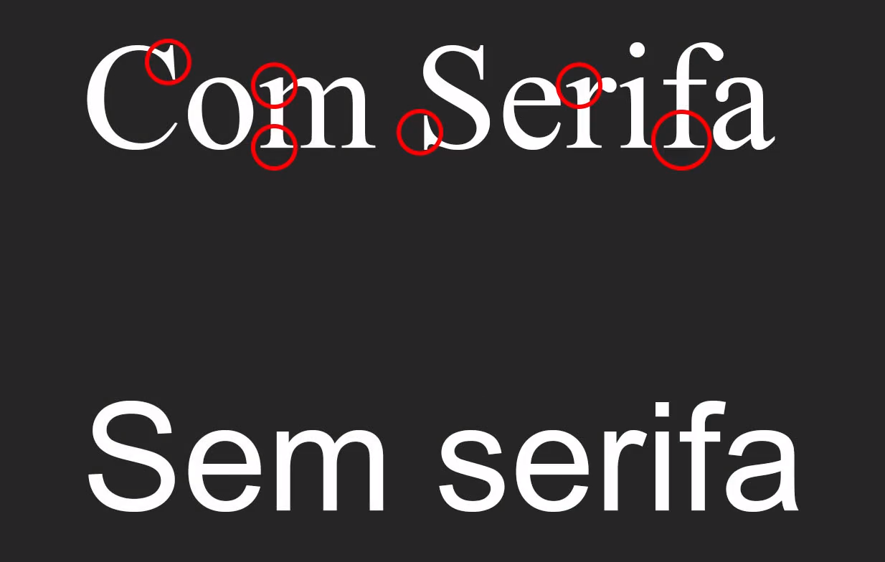

# CSS

## [voltar para o javascript](README.md)

## declaração

* CSS inline - declaração de css na tag utilizando propriedade `style`
```html
<!-- exemplo -->
<p style="color:red;"> texto </p>
```
* CSS interno - declaração de css no arquivo utilizando a tag `<style>`
```html
<!-- exemplo -->
<style>
    p{
        color:red;
    }
</style>
```
* CSS externo - declaração de css em outro arquivo utilizando a tag `<link>`
```html
<link href="arquivo_com_css.css" rel="stylesheet">
```

## Elementos background

```css
    /* adicionar imagem de funto */
    background-image: url(./images/rock-texture.jpg);
    /* definir repetição */
    background-repeat: no-repeat;
    /* definir tamanho */
    background-size: cover;
    /* comportamento de rolamento */
    background-attachment: fixed;
    
```
## Margem, preenchimento e borda
```css
    /* definir margem do elemento */
    margin: 10px; /* pode usar margin-top entre outros */
    /* definir o preenchimento do elemento */
    padding: 10px 10px; /* largura altura / pode usar padding-top entre outros */
    /* arredondamento dos cantos da borda */
    border-radius: 5px;
    /* borda  pontilhada*/
    border-style: dotted;
    /* borda tracejado */
    border-style: dashed;
    /* borda continua */
    border-style: solid;
    /* borda inexistente */
    border-style: none;
    /* borda invisível */
    border-style: hidden;
    /* definição de borda em uma linha só */
    border: 1px solid gray; /* tamanho / style / cor */

```


## Id e classes
```css
.algumacoisa{
    /* classe */
    /* são identificações que podem ser reutilizadas */
}
#algumacoisa{
    /* Id */
    /* são identificações que não podem ser reutilizadas */

}

```

```html
<tag id="algumacoisa">/progbr</tag>
<tag class="algumacoisa">/progrbr</tag>

```
## Formatação de link's
```css
link{
    /* formatação do link */
}
link:visited{
    /* formatação de link visitado */
}

```
## Ajustes no texto

```css
/* Cor de fonte */
color: red;
/* alinhamento de texto/elemento */
text-align: justify;
/* transformação de texto/elemento */
text-transform: capitalize;
/* Indentação do texto/elemento */
text-indent: 50px;
/* Decoração de texto8/elemento */
text-decoration: overline;
/* Espaço entre as letras */
letter-spacing: 2px;
/* Espaço entre as palavras */
word-spacing: 5px;
/* Espaço entre as linhas */
line-height: 2px;
/* Sombra do texto/elemento */
text-shadow: 1px 1px gray;
```

## Unidades medida fixas

* `cm` = centímetro
* `mm` = milímetro
* `in` = polegada
* `px` = pixel
* `pt` = ponto
* `pc` = picas

## Unidades medida relativa

* `em` = elemento herdara tamanho da fonte 'pai'
* `rem` = elemento herdara tamanho da fonte raiz (hedara o tamanho do body)
* `vw` = refere a largura da janela ex: `50vw` → equivale ao largura de 50% da janela.
* `vh` = refere a altura da janela ex: `50vh` → equivale ao altura de 50% da janela.
* `vmin` = refere a menor dimensão
* `vmax` = refere a maior dimensão
* `%` = sempre vai se referir ao tamanho do elemento pai.

## Elementos de fontes

```css
/* Familia fonte  */
font-family: 'Times New Roman', Times, serif;
/* Tipo de fonte */
font-style: italic;
/* Largura da Linha */
font-weight: 100;
/* Variante de fonte */
font-variant: small-caps;
/* tamanho da fonte */
font-size: 1.2rem;

```

### Fontes com serifa e sem serifa



### Fonte Monospace


## Elementos Lista

```css
/* Formatação dos pinos da lista (não ordenadas) */
list-style-type: none;/* Nenhum */
list-style-type: disk;/* Disco */   
list-style-type: circle;/* Circulo */
list-style-type: square;/* Quadrado */
/* Possição da pinagem */
list-style-position: inside; /* inside = dentro outside = fora*/
/* Definir imagem como pinagem */
list-style-image: url(./images/certo.png);

/* Formatação de pinos da lista (Ordenada) */
list-style-type: lower-roman;/* numero romanos minúsculo */
list-style-type: lower-alpha;/* numero alfa numérico minúsculo */
list-style-type: upper-roman;/* numero romanos maiúsculo */
list-style-type: upper-alpha;/* numero alfa numérico maiúsculo */
```

## Display

```css
/* Exibe um elemento como um elemento embutido (como <span>). Quaisquer propriedades de altura e largura não terão efeito */
display: inline;
/* Exibe um elemento como um elemento de bloco (como <p>). Ele começa em uma nova linha e ocupa toda a largura */
display: block;
/* Exibe um elemento como um contêiner de bloco de nível embutido. O próprio elemento é formatado como um elemento embutido, mas você pode aplicar valores de altura e largura */
display: inline-block;
/* O elemento foi completamente removido */
display: none;
```

## Overflow

Esta propriedade especifica se é necessário cortar o conteúdo ou adicionar barras de rolarem quando o conteúdo de um elemento é muito grande para caber em uma área especificada.
Nota: a `overflow` propriedade só funciona para elementos de bloco com uma altura especificada.

```css
div.ex1 {
  overflow: scroll;
  /* O estouro é cortado, mas uma barra de rolagem é adicionada para ver o resto do conteúdo */
}

div.ex2 {
  overflow: hidden;
  /* O estouro é cortado e o resto do conteúdo ficará invisível */
}

div.ex3 {
  overflow: auto;
  /* Se o estouro for cortado, uma barra de rolagem deve ser adicionada para ver o resto do conteúdo */
}

div.ex4 {
  overflow: visible;
  /* O estouro não é cortado. Ele é renderizado fora da caixa do elemento. Este é o padrão */
}

```

# Position

A propriedade `position` especifica o tipo de método de posicionamento usado para um elemento (static, relative, absolute, fixed, ou sticky).

## CSS Syntax
```css
position: static|absolute|fixed|relative|sticky|initial|inherit;
```
## Valores de propriedade

```css
div#myDIV {
    /* Valor padrão. Os elementos são renderizados em ordem, conforme aparecem no fluxo do documento */
    position:static;
}
div#myDIV {
    /* O elemento é posicionado em relação à sua posição normal, então "esquerda: 20px" adiciona 20 pixels à posição ESQUERDA do elemento */
    position:relative;
}
div#myDIV {
    /* O elemento é posicionado em relação ao primeiro elemento ancestral posicionado (não estático) */
    position:absolute;
}
div#myDIV {
    /* O elemento está posicionado em relação à janela do navegador */
    position:fixed;
}
div#myDIV {
    /* O elemento é posicionado com base na posição de rolagem do usuário. Um elemento aderente alterna entre 'relative' e 'fixed', dependendo da posição de rolagem. Ele é posicionado em relação até que uma determinada posição de deslocamento seja encontrada na janela de exibição - então, ele "se fixa" no lugar (como position:fixed). 
    
    Observação: não compatível com IE / Edge 15 ou anterior. Suportado no Safari a partir da versão 6.1 com um prefixo -webkit- */
    position: sticky;
    top: 0;
}
```

## Metodos para alteração de `position`

```css
div#myDIV {
    /* Define a borda da margem inferior para uma caixa posicionada */
    bottom: /*medidas*/;
    /* Clipes um elemento posicionado absolutamente */
    clip: /*medidas*/;
    /* Define a margem esquerda de uma caixa posicionada */
    left: /*medidas*/;
    /* Define a borda da margem direita para uma caixa posicionada */
    right: /*medidas*/;
    /* Define a borda da margem superior para uma caixa posicionada */
    top: /*medidas*/;
}
```

## Metodo Float

```css
div#myDIV {
    /* A propriedade float especifica se um elemento deve flutuar para a esquerda, direita ou não flutuar. */
    float: none|left|right|initial|inherit;
    /* A propriedade 'clear' controla o fluxo próximo aos elementos flutuantes. A propriedade 'clear' especifica o que deve acontecer com o elemento que está próximo a um elemento flutuante. Dica: Observe também a propriedade float. */
    clear: none|left|right|both|initial|inherit;
}

```
## Alinhamento de texto entre duas div's

 ```css
transform: translate(-50%, -50%);
/* comando acima deixa a div alinhada com a div pai */
/* exemplo abaixo */
.header{
    position: relative;
    margin: auto;
    width: 80%;
    height: 100px;
    background-color: gray;
}
.text{
    position: absolute;
    color: white;
    width: 70%;
    height: 70%;
    background-color: #fff;

    top: 50%;
    left: 50%;

    transform: translate(-50%,-50%);
}
 
 ```

## Centralizando elementos

[Videos de referencia](https://www.youtube.com/watch?v=Cu-HP-gvggg)

[Praticar o funcionamento de flexbox](https://flexboxfroggy.com)
## Responsividade
```html
<meta name="viewport" content="width=device-width, initial-scale=1.0">

<!-- Adicionando a meta tag acima, a pagina fica responsiva -->


```