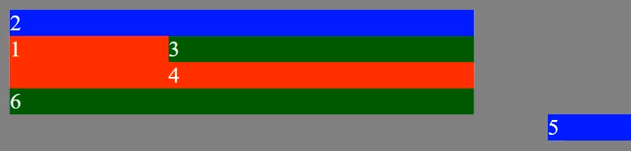

## [Voltar ao arquivo CSS.md](css.md)

# Grid

Grid e uma propriedade em CSS para criacao e personalizacao de layouts. Diferente do flex-box, Grid separa os elemento como uma grande tabela com linhas e colunas que podemos personalizar usando de algumas ferramentas que ele nos disponibiliza.

# Inicio de tudo

Para comecarmos devemos atribuir `grid` a propriedade `display`, e depois antes de comecar qualquer modificaremos os elementos definindo um templete utilizando a propriedade `grid-template-rows` para definirmos as linhas e `grid-template-columns` para as colunas.

## **Exemplo**

```css
.elemento{
    display: grid;
    grid-template-rows: auto auto; /* cada auto declarado e uma linha criada */
    grid-template-columns: auto auto; /* Casa auto e uma coluna criada
}
```

> OBS: Lembando que detro das propriedade grid-template-rows e grid-template-columns a cada propriedade definida e separada por espaco, definindo uma linha ou coluna nova.

# grid-template-rows e grid-template-columns

A propriedade `grid-template-rows` do CSS define o nome das linhas e funções de dimensionamento. E a `grid-template-columns` e a mesma coisa so que para colunas.

## **Syntax**

- `grid-template-rows/grid-template-columns: none|auto|max-content|min-content|Comprimento;`
    * `none` -> Nenhum tamanho está definido. Linhas/Colunas são criadas, se necessário
    * `auto` -> O tamanho das linhas é determinado pelo tamanho do contêiner e pelo tamanho do conteúdo dos itens na linha/Coluna
    * `max-content` -> Define o tamanho de cada linha para depender do maior item da linha/Coluna
    * `min-content` -> Define o tamanho de cada linha para depender do menor item da linha/Coluna
    * `length` -> Define o tamanho das linhas/colunas, usando um valor de comprimento legal

# grid-template

A propriedade e a uniao entre `grid-template-rows` e `grid-template-columns` separando por `/`.

## **Syntax**
- `grid-template: none|grid-template-rows / grid-template-columns|grid-template-areass`

# `fr` - Unidade de comprimento para grid

Você pode criar grids com dimensões fixas – por exemplo: definindo dimensões em pixels. Ou criar grids com dimensões flexíveis definindo-as com uso de porcentagem ou da nova unidade CSS `fr` criada para esse propósito.

Nas propriedades de `grid` podem ser utilizadas quaisquer unidades de medida. Mas para nos ajudar a criar layouts flexíveis utilizando o `grid`, foi criada uma unidade nova. A unidade `fr` representa uma fração do espaço disponível no container do `grid`.

# grid-row-gap , grid-column-gap e grid-gap

A propriedade `grid-row-gap` e `grid-column-gap` define o tamanho do intervalo entre as linhas/colunas em um layout de grade.

## **Syntax**
- `grid-row-gap/grid-column-gap: length(comprimento);`

E tambem temos o `grid-gap` que e a juncao dos dois.

## **Syntax**
- `grid-gap: grid-row-gap grid-column-gap;`

# justify-items

A propriedade `justify-items` é usada para alinhar na horizontal os elementos grid.

## **Syntax**
- `justify-items: auto | normal | start | end | flex-start | flex-end | self-start | self-end | center | left | right | baseline | first baseline | last baseline | stretch | safe | unsafe | legacy;`
    * `auto` ->Se a caixa não tiver pai ou estiver absolutamente posicionada, o valor automático será normal.
    * `normal`
        * O efeito desse valor depende do modo de layout :
            * Nos layouts de nível de bloco, o valor normal se comporta como o início.
            * Em layouts absolutamente posicionados, esse valor se comporta como o início em caixas absolutamente posicionadas substituídas e um trecho em todas as outras caixas absolutamente posicionadas.
            * Nos layouts de células da tabela, essa propriedade é ignorada.
            * Nos layouts do flexbox, essa propriedade é ignorada.
            * Nos layouts da grade, esse valor se comporta como um alongamento, exceto para caixas com uma proporção ou tamanhos intrínsecos, onde se comporta como um começo.
    * `start` -> Todos os elementos são posicionados um contra o outro na borda inicial (esquerda) do contêiner.
    * `end` -> Todos os elementos são posicionados um contra o outro na borda final (direita) do contêiner.
    * `flex-start` -> Os itens são colocados no início do contêiner.
    * `flex-end` -> Os itens são colocados no final do contêiner.
    * `self-start` -> É permitido que o item se coloque na borda do contêiner com base em seu próprio lado inicial.
    * `self-end` -> É permitido que o item se coloque na borda do contêiner com base em seu próprio lado final.
    * `center` -> Os itens são posicionados um ao lado do outro em direção ao centro do contêiner.
    * `left` -> Os itens são colocados um ao lado do outro em direção ao lado esquerdo do contêiner. Se o eixo da propriedade não estiver paralelo ao eixo em linha, esse valor se comportará como o final.
    * `right` -> Os itens são colocados um ao lado do outro no lado direito do contêiner. Se o eixo da propriedade não estiver paralelo ao eixo em linha, esse valor se comportará como iniciar.
    * `baseline first-baseline last-baseline` -> Alinha todos os elementos dentro de um grupo, combinando suas linhas de base de alinhamento.
    * `stretch` -> Estique o elemento nas duas bordas do recipiente vertical e horizontalmente para caber no recipiente.
    * `safe` -> Se o tamanho do item transbordar o contêiner de alinhamento, o item será alinhado como se o modo de alinhamento fosse iniciado.
    * `unsafe` -> Independentemente do tamanho e do contêiner de alinhamento do item, o valor do alinhamento é respeitado.
    * `legacy` -> Faz o valor herdado pelos descendentes da caixa.

# align-items

A propriedade CSS `align-items` controla o alinhamento verticalmente dentro de sua área de `grid`.

## **Syntax**
- `align-items: stretch|center|flex-start|flex-end|baseline;`
    `stretch` -> Padrão. Os itens são esticados para caber no contêiner	
    `center` -> Os itens estão posicionados no centro do contêiner
    `flex-start` -> Os itens são posicionados no início do contêiner
    `flex-end` -> Os itens são posicionados no final do contêiner
    `baseline` -> Os itens são posicionados na linha de base do contêiner


# justify-content

A propriedade CSS `justify-content` controla o alinhamento horizontal do elemento em relacao ao container(ou o pai do elemento).

## **Syntax**
- `justify-content: auto | normal | start | end | flex-start | flex-end | self-start | self-end | center | left | right | baseline | first baseline | last baseline | stretch | safe | unsafe | legacy;` -> Os mesmos do [justify-items](#justify-items)
# align-content

A propriedade CSS `align-content` controla o alinhamento vertical do elemento em relacao ao container(ou o pai do elemento).

## **Syntax**
- `align-content: stretch|center|flex-start|flex-end|baseline;` -> Os mesmos do [align-items](#align-items)

# Grid-area e grid-template-areas

Essas duas propriedades sao muito poderosas pois e com ela que podemos criar o 'esqueleto' de nosso site.

## grid-area **Syntax**
- `grid-area: itemname;`
    * Podemos usar o `grid-area` para denominar os elementos que farao parte de nosso template no grid. Assim podendo trabalhar com eles em `grid-template-areas`.

- **Exemplo**
```css
.item1 {
  grid-area: myArea1;
}
.item2 {
  grid-area: myArea2;
}
```
## grid-template-areas **Syntax**
- `grid-template-areas: none|itemnames;`
    * O `grid-template-areas` serve para organizarmos os elementos na foma que desejamos.
- **Exemplo**
```css
.grid-container {
  display: grid;
  grid-template-areas:
    'myArea1 myArea1'
    'myArea2 myArea2';
}
```
> Obs: Devemos tomar cuidado de nao deixar de usar nenhum item pois ele ficara desprendido do layout e prejudicando o projeto.



> E tambem evitar layout em '**L**' pois ele **quebra** nosso projeto

```css
.grid-container {
  display: grid;
  grid-template-areas:
    'myArea2 myArea2 myArea1'
    'myArea2 myArea2 myArea2'; /* esse tipo de layout quebra o projeto */
}

```

# Grid Column e Row Start e End

- `grid-column-start: auto|span n|column-line;` -> A propriedade `grid-column-start` define em qual linha de coluna o item será iniciado.
    * `auto`-> Valor padrão. O item será colocado após o fluxo
    * `span n`-> S	Especifica o número de colunas que o item irá abranger
    * `column-line`-> Especifica em qual coluna inicie uma exposição do item
- `grid-column-end: auto|span n|column-line;` -> A propriedade `grid-column-end` define quantas colunas um item irá abranger ou em qual linha de coluna o item terminará.
- `grid-row-start: auto|span n|column-line;` -> A propriedade `grid-row-start` define em qual linha de linha o item será iniciado.
- `grid-row-end: auto|span n|column-line;` -> A propriedade `grid-row-end` define quantas linhas um item irá abranger ou em qual linha de linha o item terminará

