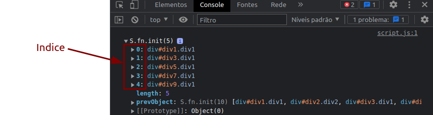

# Anotações front-end - Aprendendo Jquery

- [Voltar ao arquivo README.md](/README.md)
- [Javascrip POO](/javascript_poo.md)

# Introducao

Jquery e um framework em javascript para facilitar sua escrita;

# como usar?

Usamos o `$` como seletor de elementos.

```js
$("elemento_html")

```
E executar acoes podemos usar `arrow function` para executar eventos.

```js
$("elemento_html").hide(()=>{
    código
    })
    //podemos usar também qualquer tipo de função.
```

## Tipos de eventos

- `$("elemento_html").hide()` -> esconde elemento
- `$("elemento_html").show()` -> mostra elemento
- `$("elemento_html").click()` -> executa uma ação ao clicar no elemento.
- `$("elemento_html").mouseenter()` -> executa uma ação ao entrar no elemento com cursor.
- `$("elemento_html").mouseleave()` -> executa uma ação ao sair no elemento com cursor.
- `$("elemento_html").dblclick()` -> executa uma ação ao clicar duas vezes no elemento.

## Tipos de animacoes

- `$("elemento_html").fadeIn(time,opacidade)` -> transição `fadein`.
- `$("elemento_html").fadeOut(time,opacidade)` -> transição `fadeout`.
- `$("elemento_html").fadeToggle(time,opacidade)` -> transição `fadeToggle`.
- `$("elemento_html").slideUp(time,opacidade)` -> transição `slideUp`.
- `$("elemento_html").slideDown(time,opacidade)` -> transição `slideDown`.
- `$("elemento_html").animate(objeto,time)` -> transição `animacao personalizada` (objeto deve conter os elementos css que vc quer modificar).
- `$("elemento_html").stop()` -> evento para animação.

## Truques e solução de conflitos

1. Quando queremos utilizar um elemento que e filho de um elemento especifico podemos utilizar o sinal de `>`:

```js
// $("elemento_pai > elemento_filho").hide()
$("h1 > .item2").hide()

```

2. Quando estamos usando mais de um framework, o sinal de `$` pode conflitar com outros pacotes. Port isso podemos utilizar a expressão:

```js
$.noConflict()

```
fazendo com que o `$` seja substituído por `jquery`.

```js
//antes de declarar noConflict
$("elemento_html")
// Depois
jquery("elemento_html")

```

e ainda podemos atribuir a um variável personalizando a declaração.

```js
//antes de declarar noConflict
$("elemento_html")
// declarando noConflict e declarando em variavel 'jq'
let jq = $.noConflict()
//depois
jq("elemento_html")

```

## Utilizando callback e encadeamento

quando queremos utilizar um evento ou animação de pois de ter executado outra, usamos callback.


```html
<html lang="en">

<head>
    <meta charset="UTF-8">
    <title>Exemplo</title>
</head>

<body>
<div>
    <button class="bt1">FadeIn</button>
    <div class="div1 divMod" ></div>
</div>
    -->
    <script src="https://ajax.googleapis.com/ajax/libs/jquery/3.6.1/jquery.min.js"></script>

    <script>
        $(".bt1").click(() => {
            $(".div1").hide(1000,()=>{
                console.log("vermelho");
            });
        })

    </script>

</body>

</html>
```


E encadeamento, sever para executar eventos em seguencia

```html

<head>
    <meta charset="UTF-8">
    <title>Exemplo</title>
</head>

<body>
<div>
    <button class="bt1">FadeIn</button>
    <div class="div1 divMod" ></div>
</div>
    -->
    <script src="https://ajax.googleapis.com/ajax/libs/jquery/3.6.1/jquery.min.js"></script>

    <script>
        $(".bt1").click(() => {
            $(".div1").hide(1000).show(100);
        })

    </script>

</body>

</html>


```

da o mesmo resultado da ultima imagem.

## Mais sobre encadeamento

O elemento `$` e uma função no jquery, podendo ser atribuído a uma variável e usada como o mesmo, além de podermos usar a função `$.noConflict()` para evitar conflitos com outros frameworks.

Mas também podemos atribuir o `$` em uma variável e encadear acoes.

```js
let lista1 = $("#lista1").slideUp(1000).slideDown(1000);// atribuindo o encadeamento com o elemento $

console.log(lista1.fadeOut(1000).fadeIn(1000));// mostrando resultado e adicionando mais funções

```

## Selecionando elementos filhos

Podemos utilizar o evento `.find()` para procurar recursivamente.

- `$("elemento").find("elementa_a_ser_procurado")` -> Serve para procurarmos recursivamente todos elementos filhos, netos e etc.

podemos tambem utilisar o `.children()` que ira procurar apenas os filhos nao executando recursivamente.
 
- `$("elemento").children("elementa_a_ser_procurado")` -> Serve para procurarmos todos elementos filhos.

## Extraindo dados

Para extrais dados podemos usar as seguintes funções:

- `$("h1").text()` -> Extrai o texto
- `$("h1").html()` -> Extrai o html
- `$("h1").val()` -> Extrai o valor no atributo `value` normalmente encontrado em um elemento `<input>`.
- `$("h1").attr("nome_atributo")` -> Extrai o valor no atributo `"nome_atributo"` que foi usado como parâmetro.

## Modificando dados

Podemos reaproveitar as funções de extração, e modificamos usando os parâmetros:

- `$("h1").text("valor_modificado")` -> Modifica o texto
- `$("h1").html("valor_modificado")` -> Modifica o html
- `$("h1").val("valor_modificado")` -> Modifica o valor no atributo `value` normalmente encontrado em um elemento `<input>`.
- `$("h1").attr("nome_atributo","valor_modificado")` -> Modifica o valor no atributo `"nome_atributo"` pelo parâmetro `"valor_modificado"` >OBS: podemos usar funções no valor modificado.
## Selecionando elemento pelo atributo

Para selecionar um elemento através do atributo usamos a seguinte sintaxe:

```js

// $("[atributo = valor]")
$("[key = 2]")

```

>OBS: E sempre recomendável usar esse tipo de seleção.

## Maneiras de exclusão de elementos

- `$("h1").remove()` -> Remove elemento
- `$("h1").empty()` -> Remove todos os elementos filhos

E a função `.remove()` podemos passar como parâmetros os elementos filhos que queremos excluir.

- `$("h1").remove("elemento")` -> Remove elemento filho especifico.
- `$("h1").remove("elemento1 , elemento2")` -> Remove vários elementos filhos.

## Utilizando append - inserindo elementos

- `$("h1").append("elemento")` -> Insere dado no final do elemento mantendo o que ja foi inserido.
- `$("h1").prepend("elemento")` -> Insere dado no inicio do elemento mantendo o que ja foi inserido.
- `$("h1").after("elemento")` -> Insere elemento antes do elemento referido.
- `$("h1").before("elemento")` -> Insere elemento depois do elemento referido.

>OBS: todos esse metodos podemos inserir varios elementos ao mesmo tempo apenas separando por virgula. EX

- `$("h1").append("elemento" , "elemento2" , "elemento3")`

## Modificando elementos

- `$("h1").addClass("nome-class")` - Adiciona uma classe ao elemento.
- `$("h1").removeClass("nome-class")` - Remove a `nome-class` do e elemento.
- `$("h1").toggleClass("nome-class")` - Remove se existir a classe, e adiciona se nao existir.

Podemos modificar o `css`...

- `$("h1").css("propriedade_css")` - Acessa a propriedade css.
- `$("h1").css("propriedade_css","valor_modificado")` - Modifica a propriedade css.
- `$("h1").css({"propriedade_css":"valor_modificado","propriedade_css2":"valor_modificado2"})` - Modifica varias propriedades css.


## Extraindo Dimensões com jquery

- `$("h1").width()` -> Mostra largura
- `$("h1").innerWidth()` -> Mostra largura + padding
- `$("h1").outerWidth()` -> Mostra largura + padding + borda
- `$("h1").outerWidth(true)` -> Mostra largura + padding + borda + margin

>OBS: isso vale para altura também, so trocar `width` por `height`

E para modificar e so colocar como parâmetro das funções

- `$("h1").width(valor_modificar)` -> Modifica largura
- `$("h1").innerWidth(valor_modificar)` -> Modifica largura + padding
- `$("h1").outerWidth(valor_modificar)` -> Modifica largura + padding + borda

## Selecionando elementos irmãos, (na mesma hierarquia)

- `$("h1").siblings()` -> Seleciona todos os elementos irmãos.
- `$("h1").nextAll()` -> Seleciona todos os irmãos em seguida do elemento.
- `$("h1").next()` -> Seleciona o irmão em seguida do elemento.
- `$("h1").prev()` -> Seleciona o irmão antecessor do elemento.
- `$("h1").prevAll()` -> Seleciona todos os irmãos antecessores do elemento.

>OBS:Podemos utilizar o argumento para filtrar os elementos e retornar o dado exato que desejamos EX: `$("h1").prev(valor_filtro)`

- `$("h1").nextUntil("elemento")` -> Seleciona do elemento `h1` ate o elemento declarado no argumento `elemento` seguindo a logica da função `next`.
- `$("h1").prevUntil("elemento")` -> Seleciona do elemento `h1` ate o elemento declarado no argumento `elemento` seguindo a logica da função `prev`.

>OBS: Os elementos a seguir nao segue a logica de filtragem mencionado anteriormente.

## Outra maneiras de selecionar elementos (fim)


- `$("h1").filter("valor_filtrado")` -> Filtra múltiplas seleções que correspondem ao argumento `"valor_filtrado"`.
- `$("h1").first()` -> Seleciona o primeito elemento de um conjunto de elementos.
- `$("h1").last()` -> Seleciona o ultimo elemento de um conjunto de elementos.
- `$("h1").not("valor_filtrado")` -> Filtra múltiplas seleções que **nao** correspondem ao argumento `"valor_filtrado"`.
- `$("h1").eq("numeto_do_indice")` -> Seleciona o elemento com base no `"numeto_do_indice"` do retorno do console do navegador. 


