# Bootstrap
 
 Bootstrap e uma biblioteca composta por **classes** em CSS e **funções** em Javascript, que tem o objetivo de facilitar a criação de sites e interatividade usando apenas o HTML. 

 ## Instalação do Bootstrap

 [Bootstrap - Site official](https://getbootstrap.com)

 Para usarmos o bootstrap, podemos usar os arquivos que os criadores disponibilizam para download, ou linkar os arquivos no html do projeto.

- **Método com arquivos locais**

    1. Acessamos o site e clicamos na seção **Docs** (Ou algo parecido)

        
    
    2. Acessamos a pagina de **download** do arquivos do Bootstrap

        

    3. Na seção **Compiled CSS and JS** podemos ver o botão de download, dai so realizar o download

        

    4. Apos ter baixado o aquivo, so descompactar e colocar na pasta do projeto onde deseja implementar o bootstrap

        
        

    5. Segue um exemplo de como devemos linkar os arquivos no html

        ```html

        <!DOCTYPE html>
        <html lang="pt-br">

        <head>
            <meta charset="UTF-8">
            <title>Testando Firebase</title>
            <link rel="stylesheet" href="/css/style.css">
            <!-- Abaixo o link para o css do bootstrap -->
            <link rel="stylesheet" href="bootstrap-5.3.0-alpha1-dist/css/bootstrap.css">
        </head>

        <body>
            <!-- Linkamos tambe o Jquery pois o bootstrap utiliza ele amplamente -->
            <script src="https://ajax.googleapis.com/ajax/libs/jquery/3.6.1/jquery.min.js"></script>
            <!-- Abaixo o link para o JS do bootstrap -->
            <script src="bootstrap-5.3.0-alpha1-dist/js/bootstrap.js"></script>
        </body>

        </html>

        ```

- **Método utilizando arquivos web**

    Para utilizar utilizar podemos linkar direto no HTML os endereços que a documentação no site disponibiliza.

    ```html
    <!DOCTYPE html>
    <html lang="pt-br">

    <head>
        <meta charset="UTF-8">
        <title>Testando Firebase</title>
        <link rel="stylesheet" href="/css/style.css">
        <!-- Abaixo o link web para o css do bootstrap -->
        <link href="https://cdn.jsdelivr.net/npm/bootstrap@5.3.0-alpha1/dist/css/bootstrap.min.css" rel="stylesheet" integrity="sha384-GLhlTQ8iRABdZLl6O3oVMWSktQOp6b7In1Zl3/Jr59b6EGGoI1aFkw7cmDA6j6gD" crossorigin="anonymous">
    </head>

    <body>
        <!-- Linkamos tambe o Jquery pois o bootstrap utiliza ele amplamente -->
        <script src="https://ajax.googleapis.com/ajax/libs/jquery/3.6.1/jquery.min.js"></script>
        <!-- Abaixo o link web para o JS do bootstrap junto com o popper (utilizado para fazer pop ups) -->
        <script src="https://cdn.jsdelivr.net/npm/@popperjs/core@2.11.6/dist/umd/popper.min.js" integrity="sha384-oBqDVmMz9ATKxIep9tiCxS/Z9fNfEXiDAYTujMAeBAsjFuCZSmKbSSUnQlmh/jp3" crossorigin="anonymous"></script>
        <script src="https://cdn.jsdelivr.net/npm/bootstrap@5.3.0-alpha1/dist/js/bootstrap.min.js" integrity="sha384-mQ93GR66B00ZXjt0YO5KlohRA5SY2XofN4zfuZxLkoj1gXtW8ANNCe9d5Y3eG5eD" crossorigin="anonymous"></script>
    </body>

    </html>

    ```

    >OBS: Voce pode consultar a documentação, pois essa anotação pode estar desatualizada

# Como o bootstrap funciona?

O bootstrap funciona com o sistema de `classes` CSS e funções `JS` que sao declaradas através do HTML. Isso significa se seguirmos um das formas de [Instalação do Bootstrap](#instalação-do-bootstrap), trabalhemos apenas com o `HTML` declarando apenas classes que ja conterão configuraçoes pre-programada.

EX:

```html

<div class="text">Texto</div>

```

# Classes `CSS` utilizadas

## Bootstrap - Cores

```html
<div class="text-bg-primary p-3">Primary = Azul Escuro</div>
<div class="text-bg-secondary p-3">Secondary = Cinza</div>
<div class="text-bg-success p-3">Success = Verde</div>
<div class="text-bg-danger p-3">Danger = Vermelho</div>
<div class="text-bg-warning p-3">Warning = Amarelo</div>
<div class="text-bg-info p-3">Info = Azul Claro</div>
<div class="text-bg-light p-3">Light = Branco</div>
<div class="text-bg-white p-3">White = Branco</div>
<div class="text-bg-dark p-3">Dark = Preto</div>

```
Resultado:


## Alguns tipos de elementos - Botão, Texto, Background e etc

```html
<div class="btn">Botão</div>
<div class="text">Texto</div>
<div class="bg-dark">Background Dark</div>


```
Resultado:


## Bootstrap - Títulos e Display


```html
    <h1 class="display-1">Titulo Display 1</h1>
    <h2 class="display-2">Titulo Display 2</h2>
    <h3 class="display-3">Titulo Display 3</h3>
    <h4 class="display-4">Titulo Display 4</h4>
    <h1 >Titulo H1</h1>
    <h2 >Titulo H2</h2>
    <h3 >Titulo H3</h3>
    <h4 >Titulo H4</h4>

```
Resultado:


```html
    <p class="h1">Titulo H1 com bootstrap</p>
    <p class="h2">Titulo H2 com bootstrap</p>
    <p class="h3">Titulo H3 com bootstrap</p>
    <p class="h4">Titulo H4 com bootstrap</p>

```

> * Podemos aplicar titulos `html` em qualquer elemento, mas nao tera peso semântico

Resultado:


## Bootstrap - Padding e Margin

> A partir desse tópico evitarei de mostrar imagens para agilizar minhas anotações. Irei mostrar apenas html.


* Padding = `p-X` / *X pode ser de 0 ate 5*

    ```html
    <p class="bg-info p-1">Tamanho do padding 1</p>
    <p class="bg-info p-2">Tamanho do padding 2</p>
    <p class="bg-info p-3">Tamanho do padding 3</p>
    <p class="bg-info p-4">Tamanho do padding 4</p>
    <p class="bg-info p-5">Tamanho do padding 5</p>
    <!-- Sendo o p-0 sem padding -->
    ```


* Padding Start(Left), End(Right), Bottom e Top = `ps-X`, `pe-X`, `pb-X`, `pt-X`

    ```html
    <p class="bg-info ps-5">Tamanho 5, lado Start do padding </p>
    <p class="bg-info pe-5">Tamanho 5, lado End do padding </p>
    <p class="bg-info pb-5">Tamanho 5, lado Bottom do padding </p>
    <p class="bg-info pt-5">Tamanho 5, lado Top do padding </p>
    ```

    > A logica funciona em margin também...

* Padding Y (Vertical) e X(Horizontal) = `py-x` e `px-x`

    ```html
    <p class="bg-info py-3">Tamanho Vertical do padding</p>
    <p class="bg-info px-4">Tamanho Horizontal do padding</p>

    ```
* Padding auto = `p-auto` / *centraliza elementos como no `HTML`*

    ```HTML
    <p class="bg-info py-auto">Tamanho Vertical do padding</p>
    <p class="bg-info px-auto">Tamanho Horizontal do padding</p>
    ```

* Margin = `m-X` / *X pode ser de 0 ate 5*

    ```html
    <p class="bg-info m-1">Tamanho do margin 1</p>
    <p class="bg-info m-2">Tamanho do margin 2</p>
    <p class="bg-info m-3">Tamanho do margin 3</p>
    <p class="bg-info m-4">Tamanho do margin 4</p>
    <p class="bg-info m-5">Tamanho do margin 5</p>
    <!-- Sendo o m-0 sem margin -->
    ```

* Margin Start(Left), End(Right), Bottom e Top = `ms-X`, `me-X`, `mb-X`, `mt-X`

    ```html
    <p class="bg-info ms-5">Tamanho 5, lado Start do margin </p>
    <p class="bg-info me-5">Tamanho 5, lado End do margin </p>
    <p class="bg-info mb-5">Tamanho 5, lado Bottom do margin </p>
    <p class="bg-info mt-5">Tamanho 5, lado Top do margin </p>
    ```


* Margin Y (Vertical) e X(Horizontal) = `my-x` e `mx-x`

    ```html
    <p class="bg-info my-3">Tamanho Vertical do margin</p>
    <p class="bg-info mx-4">Tamanho Horizontal do margin</p>

    ```
* Margin auto = `m-auto` / *centraliza elementos como no `HTML`*

    ```HTML
    <p class="bg-info my-auto">Tamanho Vertical do Margin</p>
    <p class="bg-info mx-auto">Tamanho Horizontal do Margin</p>
    ```

# Bootstrap - Container

Containers servem para separarmos em blocos que de auto ajustam melhoram a responsividade da pagina

* Container = `container`

    ```html
    <div class="container">
        <h1>Lorem Ipsum</h1>
        <p>
            Lorem ipsum dolor sit amet, consectetur adipiscing elit. Phasellus et erat ultrices, tristique leo id, sagittis
            libero. Vivamus non porta sem. Pellentesque gravida libero id turpis elementum viverra. Praesent urna ex, luctus
            vitae mollis eu, euismod eget nunc. Sed posuere metus id augue semper porta. Morbi ultrices posuere dui, sed
            imperdiet tortor commodo volutpat. Phasellus pharetra volutpat libero eget pulvinar. Fusce eget molestie sapien.
            Sed quis semper risus, vel suscipit felis. Duis ultrices at velit id tincidunt.
        </p>
    </div>

    ```

    Exemplo aplicando a classe `container`:

    

    Exemplo nao aplicando:

    

# Bootstrap - Display + Float (CSS)

[Mais sobre a propriedade Display](./css.md#display)

[Mais sobre a propriedade Float](./css.md#metodo-float)

* Display Block = `d-block`
    
    ```HTML
    <p class="bg-info d-block">Display Block</p>
    ```
* Display Inline = `d-inline`
    
    ```HTML
    <p class="bg-info d-inline">Display Inline</p>
    ```
* Display float left e Right = `float-start` e `float-end`
    
    ```HTML
    <p class="bg-info float-star">float start/left</p>
    <p class="bg-info float-end">float end/right</p>
    ```

# Bootstrap - Responsividade

No bootstrap podemos adicionar um delimitador que faz que a classe so tenha um efeito caso tenha um determinado tamanho de tela. Esses delimitadores sao:

* `sm` -> small/576px
* `md` -> medium/768px
* `lg` -> large/992px
* `xl` -> xlarge/1200px

Nao sao todas classes que aceitam esse delimitadores, por esse motivo e bom consultar documentação.

Exemplo de uso:

```HTML
<p class="float-sm-star">float small start/left</p>
<p class="float-md-star">float medium start/left</p>
<p class="float-lg-star">float large start/left</p>
<p class="float-xl-star">float xlarge start/left</p>
```

# Bootstrap - Flexbox

A logica para usarmos flexbox no bootstrap e basicamente isso: `propriedade-valor`. Segue alguns propriedades em `flexbox` para `bootstrap`

## Display

* `display: flex;` = `d-flex`

## Flex-direction

- `flex-direction: row;` = `flex-row`
- `flex-direction: row-reverse;` = `flex-row-reverse`
- `flex-direction: column;` = `flex-column`
- `flex-direction: column-reverse;` = `flex-column-reverse`

## Justify-content

- `justify-content: flex-start` = `justify-content-start` 
- `justify-content: flex-end` = `justify-content-end` 
- `justify-content: center` = `justify-content-center` 
- `justify-content: between` = `justify-content-between` 
- `justify-content: around` = `justify-content-around` 
- `justify-content: evenly` = `justify-content-evenly`


## Align-items
- `align-items: flex-start` = `align-items-start`
- `align-items: flex-end` = `align-items-end`
- `align-items: center` = `align-items-center`
- `align-items: baseline` = `align-items-baseline`
- `align-items: stretch` = `align-items-stretch`

## Align-self

- `align-self: fles-start` = `align-self-start`
- `align-self: fles-end` = `align-self-end`
- `align-self: center` = `align-self-center`
- `align-self: baseline` = `align-self-baseline`
- `align-self: stretch` = `align-self-stretch`

## Flex-wrap

- `flex-wrap: nowrap` = `flex-nowrap`
- `flex-wrap: wrap` = `flex-wrap`

[Para saber mais como funciona o Flexbox no CSS. Click Aqui](./flex_box.md)

# Grid
[Para saber mais como funciona o Grid no CSS. Click Aqui](./grid.md)

> O grid e declarado junto com o flebox, mas nao e necessário utilizar o `d-flex`. Apenas declarando as linhas e colunas e tudo certo.
## Rows

- `grid-template-rows: auto;` = `rows`

## Columns

- `grid-template-columns: auto;` = `col`

## Base de 12 colunas

No Grid no bootstrap apesar de nos podermos colocar inúmeras colunas, o sistema de distribuição e com em 12 colunas. Exemplo:

```html
<div class="row">
        
    <div class="bg-info col-3">coluna1</div>
    <div class="bg-success col">coluna2</div>

</div>

```

no caso acima eu defini que a coluna um ocupara 3 (`col-3`) espaços. Levando em conta que o bootstrap se baseia com 12 espaços/colunas,ele deduzira que o valor da coluna2 sera de nove (`col-9`) ja que nao passei valor nenhum.


E caso eu passasse o seguinte:

```html
<div class="row">
        
    <div class="bg-info col-3">coluna1</div>
    <div class="bg-success col-3">coluna2</div>

</div>

```

Seria coluna 1 e 2 ocupando 3 espacos (`col-3`) que somados totalizam 6 colunas ocupadas. As outras 6 sao ocupadas por espaços vazios.


## Responsividade no grid

No grid podemos usar os parâmetros de [resposividade](#bootstrap---responsividade): `sm`, `md`, `lg` e `xl`
que terão o mesmo efeito no que ja foi dito.

```html
<div class="row">
        
    <div class="bg-info col-md-3">coluna1</div><!-- aplicando responsividade  -->
    <div class="bg-success col-3">coluna2</div>
    <div class="bg-info col-3">coluna1</div>
    <div class="bg-success col-3">coluna2</div>
    
</div>
```

Resultado:


## Flexbox no Grid

Podemos utilizar elementos do flexbox no grid normalmente. Exemplo:

```html
<div class="row justify-content-between"><!-- aplicando flexbox  -->
    <div class="bg-info col-2">coluna1</div>
    <div class="bg-success col-2">coluna2</div>
</div>

<div class="row">
    <div class="bg-info col-3">coluna1</div>
    <div class="bg-success col-3">coluna2</div>
</div>

```

resultado:


# Bootstrap - Tipografia

## Peso de fontes


- `fw-bold` =  Negrito.

- `fw-bolder` =  Texto com peso em negrito (relativo ao elemento pai).

- `fw-semibold` =  Semi negrito.

- `fw-normal` =  Normal.

- `fw-light` =  Claro.

- `fw-lighter` =  Texto com peso Claro (relativo ao elemento pai).

- `fst-italic` =  Itálico.

- `fst-normal` =  Texto com fonte normal

## Formatação de texto


- `text-start` = Texto a esquerda

- `text-center` = Texto no centro

- `text-end` = Texto a direita

>obs: o texto justificado foi retirado no bootstrap, como usarmos teremos que usar manualmente com css puro `text-align: justify;`

- `font-monospace` = deixar o texto em monospace (font-padrão)

- `text-lowercase` = Texto em minusculo

- `text-uppercase` = Texto em maiúsculo

- `text-capitalize` = Texto capitalizado

- `text-decoration-none` = Texto sem decoração

- `list-unstyled` = Lista sem decoração

# Bootstrap - Tabelas

- `table` = Classe que formata a tabela no formato padrão do bootstrap. Muito mais bonito


- `table-striped` = Tabela listrada

- `table-bordered` = Tabela com bordas

- `table-borderless` = Tabela sem bordas

- `table-hover` = Tabela com efeito ao passar o mouse em cima

- `table-dark` = Tabela com estilo Dark

> Esses estilos podem ser aplicados em linhas individuais

```html
<table class="table table-dark table-hover">
    <thead>
        <tr>
            <th>Nome</th>
            <th>Sobrenome</th>
        </tr>
    </thead>
    <tbody>
        <tr class="table-success"> <!-- aplicando formatação em uma linha  -->
            <td>Massaru</td>
            <td>Hagio</td>
        </tr>
        <tr class="table-danger"> <!-- mesma coisa  -->
            <td>Yuuko</td>
            <td>Hagio</td>
        </tr>
    </tbody>
</table>

```


> Caso queira aplicar formatação no cabeçalho so substituir `table` por `thead` EX: `thead-dark` e `thead-light`

- `table-sm` = Tabela padding compacto

- `table-resposive` = Tabela responsiva (Quando nao puder aparecer os dados na janela, aparecera um scrolling na tela)

# Bootstrap - Alertas

- `alert` = Deixa em formato de alert

- `alert-danger` = Deixa no formado alert e na cor `danger` ([mais sobre cores click aqui!](#bootstrap---cores))

- `alert-link` = Link em formato de alerta

- `alert-dismissible` = Aparentamento nao faz nada, mas se voce criar um `button` e adicionar a propriedade `data-bs-dismiss='alert'`, caso o usuário click no botão o alerta sera fechado.

```html
<div class="alert alert-danger alert-dismissible">
        <button class="btn-close" data-bs-dismiss="alert"></button>
        este e o meu alerta
    </div>

```


# Bootstrap - Botão

- `btn` = Classe padrão de botão no bootstrap.

## Cor dos botãos

- `btn-primary` = Primary / Azul Escuro

- `btn-secondary` = Secondary / Cinza

- `btn-success` = Success / Verde

- `btn-danger` = Danger / Vermelho

- `btn-warning` = Warning / Amarelo

- `btn-info` = Info / Azul Claro

- `btn-light` = Light / Branco

- `btn-white` = White / Branco

- `btn-dark` = Dark / Preto

- `btn-link` = Link / Cor padrão de Link

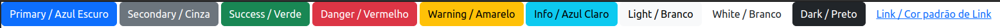

## Estilo de Botoes podem ser utilizados em outros tipos de elemento html

```html
<input type="submit" class="btn btn-success" value="Enviar">

<a href="#" class="btn btn-primary">Facebook</a>

```


## `btn` outline

- `btn-outline-primary` = Primary / Azul Escuro com outline


Funciona com cor de estilo de qualquer botão.

## Tamanho

- `btn-sm` = botão pequeno (small)

- `btn-lg` = botão grande (large)

- `btn-block` = botão vai ocupar toda a largura da tela

## Active / Disable

- `active` = Estilo do botão fica como se estivesse ativo

- `disable` = Estilo do botão fica como se estivesse inativo

## Agrupando de Botoes

- **Agrupamento simples**

```html
    <div class="btn-group">
        <button>botão1</button>
        <button>botão2</button>
        <button>botão3</button>
        <button>botão4</button>
    </div>
```

- **Agrupamento composto**

```html
    <div class="btn-group">
        <button>botão1</button>
        <button>botão2</button>
        <button>botão3</button>
        <button>botão4</button>
        <div class="btn-group">
            <button>botão1</button>
            <button>botão2</button>
            <button>botão3</button>
            <button>botão4</button>
        </div>
    </div>
```

- **Agrupamento tamanho**

```html
    <div class="btn-group btn-group-sm">
        <button>botão1</button>
        <button>botão2</button>
        <button>botão3</button>
        <button>botão4</button>        
    </div>
    <div class="btn-group btn-group-lg">
        <button>botão1</button>
        <button>botão2</button>
        <button>botão3</button>
        <button>botão4</button>        
    </div>
```

- **Agrupamento vertical**

```html
    <div class="btn-group-vertical">
        <button>botão1</button>
        <button>botão2</button>
        <button>botão3</button>
        <button>botão4</button>        
    </div>
```

# Bootstrap - Collapse

O classe `collapse` faz com que um elemento html seja mostrado diante de uma ação. Para usarmos esse recurso devemos definir um elemento com a classe `collapse` se recebera o evento e outro efetuara o evento.

```html
    <button data-bs-toggle="collapse" data-bs-target="#teste">Mostrar</button>
    <div id="teste" class="collapse">Collapse</div>
```


O elemento que efetuara a ação e composto pela propriedade `data-bs-toggle` (define quais classes surtirão o efeito) e `data-bs-target` (Define qual elemento recebera o efeito). EX: `<button data-bs-toggle="collapse" data-bs-target="#teste">Mostrar</button>`

Caso queira que o elemento ao invés de desaparecer e aparece, podemos fazer o contrario com a classe `show`.

```html
    <button data-bs-toggle="collapse" data-bs-target="#teste">Mostrar</button>
    <div id="teste" class="collapse show">Collapse</div>
```


# Bootstrap - DropDown

DropDown e um botão que abre um menu/lista de opções para o usuario.

```html

    <div class="container">
        <div class="dropdown"><!-- criando div dropdown  -->
            <button class="btn btn-info dropdown-toggle" data-bs-toggle="dropdown">Atividades</button><!-- definindo botão responsável pelo dropdown -->
            <div class="dropdown-menu"><!-- criando menu  -->
                <!-- Elementos do menu  -->
                <a class="dropdown-item" href="#">menu1</a>
                <a class="dropdown-item" href="#">menu2</a>
                <a class="dropdown-item" href="#">menu3</a>
                <a class="dropdown-item" href="#">menu4</a>
                <!-- class="dropdown-item" Serve para organizarmos os itens em uma lista vertical. -->
            </div>
        </div>
    </div>

```


## dropdown-divider

Podemos dividir o menu...

```html
<div class="dropdown">
    <button class="btn btn-info dropdown-toggle" data-bs-toggle="dropdown">Atividades</button>
    <div class="dropdown-menu">
        <a class="dropdown-item" href="#">menu1</a>
        <a class="dropdown-item" href="#">menu2</a>
        <a class="dropdown-item" href="#">menu3</a>
        <a class="dropdown-item" href="#">menu4</a>
        <div class="dropdown-divider"></div><!-- Divider -->
        <a class="dropdown-item" href="#">menu1</a>
        <a class="dropdown-item" href="#">menu2</a>
        <a class="dropdown-item" href="#">menu3</a>
        <a class="dropdown-item" href="#">menu4</a>
    </div>
</div>

```

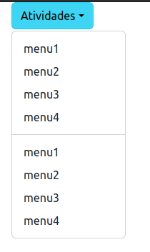

## dropdown-header

Podemos definir cabeçalhos no menu...

```html
<div class="dropdown">
    <button class="btn btn-info dropdown-toggle" data-bs-toggle="dropdown">Atividades</button>
    <div class="dropdown-menu">
        <div class="dropdown-header"> Header Menu</div><!-- Header Menu -->                
        <a class="dropdown-item" href="#">menu1</a>
        <a class="dropdown-item" href="#">menu2</a>
        <a class="dropdown-item" href="#">menu3</a>
        <a class="dropdown-item" href="#">menu4</a>
        <div class="dropdown-header"> Header Menu 2</div><!-- Header Menu -->
        <a class="dropdown-item" href="#">menu1</a>
        <a class="dropdown-item" href="#">menu2</a>
        <a class="dropdown-item" href="#">menu3</a>
        <a class="dropdown-item" href="#">menu4</a>
    </div>
</div>
```

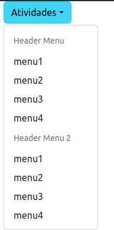


> As classe `active` e `disable` funcionam normalmente em qualquer `dropdown`.

## Direção da abertura de menus

Mudando classe no `<div class="dropdown">` podemos mudar direção adicionando alguns argumentos extras. 

**Centered**

```html
    <div class="container">
        <div class="dropdown-center">
            <button class="btn btn-info dropdown-toggle" data-bs-toggle="dropdown">Atividades</button>
            <div class="dropdown-menu">               
                <a class="dropdown-item" href="#">menu1</a>
                <a class="dropdown-item" href="#">menu2</a>
                <a class="dropdown-item" href="#">menu3</a>
            </div>
        </div>
    </div>
```

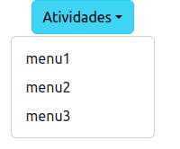

**Dropup**


```html
    <div class="container">
        <div class="dropdown fixed-bottom dropup">
            <!-- a classe fixed-bottom e apenas para jogar o botão para a parte inferior da tela. Nao e obrigatório. eu fiz isso por que caso contrario o menu suspenso nao apareceria no topo -->
            <button class="btn btn-info dropdown-toggle" data-bs-toggle="dropdown">Atividades</button>
            <div class="dropdown-menu">               
                <a class="dropdown-item" href="#">menu1</a>
                <a class="dropdown-item" href="#">menu2</a>
                <a class="dropdown-item" href="#">menu3</a>
            </div>
        </div>
    </div>
```

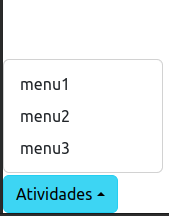

**Dropup centered**


```html
    <div class="container">
        <div class="dropdown-center fixed-bottom dropup">
            <button class="btn btn-info dropdown-toggle" data-bs-toggle="dropdown">Atividades</button>
            <div class="dropdown-menu">               
                <a class="dropdown-item" href="#">menu1</a>
                <a class="dropdown-item" href="#">menu2</a>
                <a class="dropdown-item" href="#">menu3</a>
            </div>
        </div>
    </div>
```

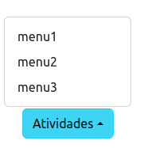

**Dropend**


```html
    <div class="container">
        <div class="dropdown dropend">
            <button class="btn btn-info dropdown-toggle" data-bs-toggle="dropdown">Atividades</button>
            <div class="dropdown-menu">               
                <a class="dropdown-item" href="#">menu1</a>
                <a class="dropdown-item" href="#">menu2</a>
                <a class="dropdown-item" href="#">menu3</a>
            </div>
        </div>
    </div>
```

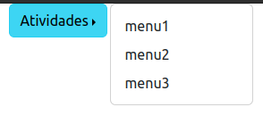

**Dropstart**


```html
    <div class="container">
        <div class="dropdown dropstart">
            <button class="btn btn-info dropdown-toggle" data-bs-toggle="dropdown">Atividades</button>
            <div class="dropdown-menu">               
                <a class="dropdown-item" href="#">menu1</a>
                <a class="dropdown-item" href="#">menu2</a>
                <a class="dropdown-item" href="#">menu3</a>
            </div>
        </div>
    </div>
```

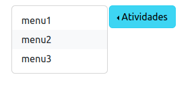

## Utilizando btn-group

podemos utiliza `btn-group` para colocarmos dois botoes unificados, sendo um descrição e o outro o `dropdown`...

```html
        <div class="btn-group">
            <button class="btn btn-info">Atividades</button>
            <button class="btn btn-info dropdown-toggle" data-bs-toggle="dropdown"></button>
            <div class="dropdown-menu">               
                <a class="dropdown-item" href="#">menu1</a>
                <a class="dropdown-item" href="#">menu2</a>
                <a class="dropdown-item" href="#">menu3</a>
            </div>
        </div>

```


# Bootstrap - Cards

Podemos criar `cards` no bootstrap atribuindo um elemento html com o mesmo...

```html
<div class="card">
    Card
</div>

```
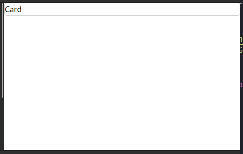

podemos separar o card em seções como em uma pagina web...

```html
<div class="card w200">
    <div class="card-header">
        header
    </div>
    <div class="card-body">
        body
    </div>
    <div class="card-footer">
        footer
    </div>
</div>
```
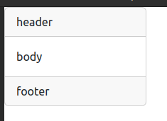

# Bootstrap - Accordion


Código:

```html
<div class="card">
    <div class="card-header">
        <a href="#resp1" class="card-link" data-bs-toggle="collapse">
            Pergunta 1
        </a>
    </div>
    <div id="resp1" class="collapse">
        <div class="card-body">
            Resposta 1
        </div>
    </div>
</div>
```

Apesar de estar usando a classe `card` do bootstrap, a logica valeria para qualquer elemento.

## Utilizando vários `Accordion`


> Todos abrem e fecham manualmente.

Código:

```html
<div class="card">
    <div class="card-header">
        <a href="#resp1" class="card-link" data-bs-toggle="collapse">
            Pergunta 1
        </a>
    </div>
    <div id="resp1" class="collapse">
        <div class="card-body">
            Resposta 1
        </div>
    </div>
</div>
<div class="card">
    <div class="card-header">
        <a href="#resp2" class="card-link" data-bs-toggle="collapse">
            Pergunta 2
        </a>
    </div>
    <div id="resp2" class="collapse">
        <div class="card-body">
            Resposta 2
        </div>
    </div>
</div>
<div class="card">
    <div class="card-header">
        <a href="#resp3" class="card-link" data-bs-toggle="collapse">
            Pergunta 3
        </a>
    </div>
    <div id="resp3" class="collapse">
        <div class="card-body">
            Resposta 3
        </div>
    </div>
</div>
```


> Todos abrem e fecham individualmente e fecham automaticamente.

Código:

```html
<div id="accordion">
    <div class="card">
        <div class="card-header">
            <a href="#resp1" class="card-link" data-bs-toggle="collapse">
                Pergunta 1
            </a>
        </div>
        <div id="resp1" class="collapse" data-bs-parent="#accordion">
            <div class="card-body">
                Resposta 1
            </div>
        </div>
    </div>
    <div class="card">
        <div class="card-header">
            <a href="#resp2" class="card-link" data-bs-toggle="collapse">
                Pergunta 2
            </a>
        </div>
        <div id="resp2" class="collapse" data-bs-parent="#accordion">
            <div class="card-body">
                Resposta 2
            </div>
        </div>
    </div>
    <div class="card">
        <div class="card-header">
            <a href="#resp3" class="card-link" data-bs-toggle="collapse">
                Pergunta 3
            </a>
        </div>
        <div id="resp3" class="collapse" data-bs-parent="#accordion">
            <div class="card-body">
                Resposta 3
            </div>
        </div>
    </div>
```

# Bootstrap - Progress Bar

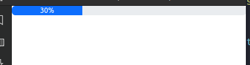

Código:

```html
<div class="progress">
    <div class="progress-bar" style="width: 30%;">30%</div>
</div>
```

## Trocando cor

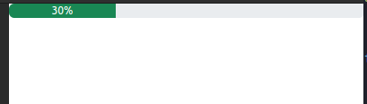

Código:

```html
<div class="progress">
    <div class="progress-bar bg-success" style="width: 30%;">30%</div>
</div>
```

## Aumentando de tamanho

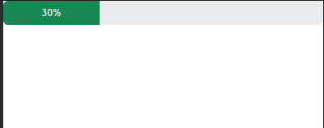

Código:

```html
<div class="progress" style="height: 30px;">
    <div class="progress-bar bg-success" style="width: 30%;height: 30px;">30%</div>
</div>
```

## Barra listrada

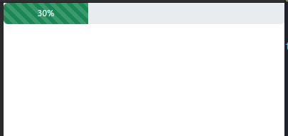

Código:

```html
<div class="progress" style="height: 30px;">
    <div class="progress-bar bg-success progress-bar-striped" style="width: 30%;height: 30px;">30%</div>
</div>
```
## Barra listrada animada


Código:

```html
<div class="progress" style="height: 30px;">
    <div class="progress-bar bg-success progress-bar-striped progress-bar-animated" style="width: 30%;height: 30px;">30%</div>
</div>
```
## Barra listrada animada com progresso


Código:

```html
<div class="progress" style="height: 30px;">
    <div class="progress-bar bg-success progress-bar-striped progress-bar-animated"
        style="width: 30%;height: 30px;">30%</div>
</div>

<script>
    let progressBar = document.querySelector(".progress-bar");
    progressBar.innerHTML = "0%";
    progressBar.style.width = "0%";

    let value = 0;

    setInterval(()=>{
        if(value > 100){
            value = 100
        }
        progressBar.innerHTML = value + "%";
        progressBar.style.width = value + "%";
        value++;

    },200)
</script>
```
## Múltiplos progressos em uma barra

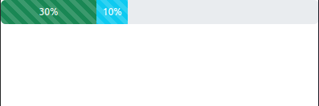

Código:

```html
<div class="progress" style="height: 30px;">
    <div class="progress-bar bg-success progress-bar-striped progress-bar-animated"
        style="width: 30%;height: 30px;">30%</div>
    <div class="progress-bar bg-info progress-bar-striped progress-bar-animated"
        style="width: 10%;height: 30px;">10%</div>
</div>
```


# Bootstrap - Spinner


Código:

```html

<div class="spinner-border"></div>

```

## Mudando cor do Spinner


Código:

```html

<div class="spinner-border text-info"></div>

```
## Mudando tamanho do Spinner


- **pequeno**


Código:

```html

<div class="spinner-border spinner-border-sm"></div>

```
## Spinner Grow


Código:

```html

<div class="spinner-grow"></div>

```

# Bootstrap - Lista agrupada


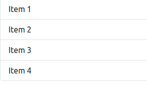

Código:

```html

<ul class="list-group">
    <li class="list-group-item">Item 1</li>
    <li class="list-group-item">Item 2</li>
    <li class="list-group-item">Item 3</li>
    <li class="list-group-item">Item 4</li>
</ul>

```

- **Ativada**

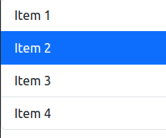

Código:

```html

<ul class="list-group">
    <li class="list-group-item">Item 1</li>
    <li class="list-group-item active">Item 2</li>
    <li class="list-group-item">Item 3</li>
    <li class="list-group-item">Item 4</li>
</ul>

```

> `List-group` poder ser implementado em qualquer elemento.

## Utilizando `list-group` em outro elemento

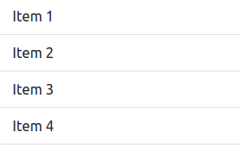

Código:

```html

<div class="list-group">
    <a href="#" class="list-group-item">Item 1</a>
    <a href="#" class="list-group-item">Item 2</a>
    <a href="#" class="list-group-item">Item 3</a>
    <a href="#" class="list-group-item">Item 4</a>
</div>

```

> Como pode ver temos um resultado muito parecido, apesar de estarmos utilizando links. 
## Eliminando formatação do link (pode ser aplicado em qualquer elemento)

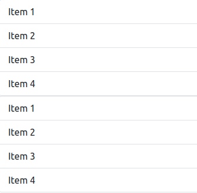

Código:

```html

<!-- APLICANDO list-group-item-action -->
<div class="list-group">
    <a href="#" class="list-group-item list-group-item-action">Item 1</a>
    <a href="#" class="list-group-item list-group-item-action">Item 2</a>
    <a href="#" class="list-group-item list-group-item-action">Item 3</a>
    <a href="#" class="list-group-item list-group-item-action">Item 4</a>
</div>
<!-- SEM list-group-item-action -->
<div class="list-group">
    <a href="#" class="list-group-item">Item 1</a>
    <a href="#" class="list-group-item">Item 2</a>
    <a href="#" class="list-group-item">Item 3</a>
    <a href="#" class="list-group-item">Item 4</a>
</div>

```

> Nesse caso os links ja estavam estavam sem formatação. 

- **Desativando**

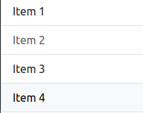

Código:

```html

<div class="list-group">
    <a href="#" class="list-group-item list-group-item-action">Item 1</a>
    <a href="#" class="list-group-item list-group-item-action disabled">Item 2</a>
    <a href="#" class="list-group-item list-group-item-action">Item 3</a>
    <a href="#" class="list-group-item list-group-item-action">Item 4</a>
</div>

```

## Eliminando bordas laterais de uma lista

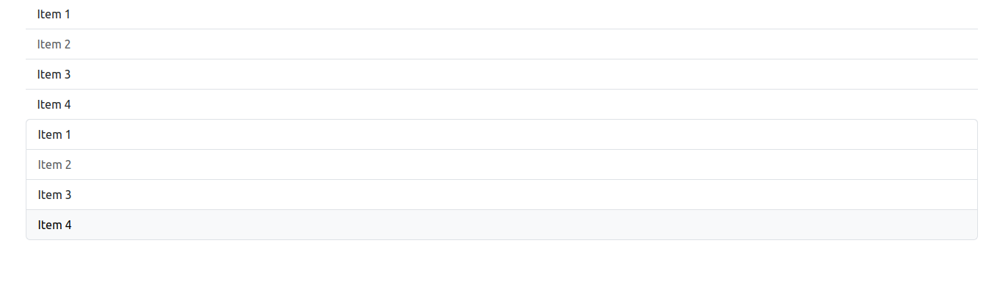

Código:

```html

<div class="container">
    <!-- APLICANDO list-group-flush -->
    <div class="list-group list-group-flush">
        <a href="#" class="list-group-item list-group-item-action">Item 1</a>
        <a href="#" class="list-group-item list-group-item-action disabled">Item 2</a>
        <a href="#" class="list-group-item list-group-item-action">Item 3</a>
        <a href="#" class="list-group-item list-group-item-action">Item 4</a>
    </div>
    <!-- SEM list-group-flush -->
    <div class="list-group">
        <a href="#" class="list-group-item list-group-item-action">Item 1</a>
        <a href="#" class="list-group-item list-group-item-action disabled">Item 2</a>
        <a href="#" class="list-group-item list-group-item-action">Item 3</a>
        <a href="#" class="list-group-item list-group-item-action">Item 4</a>
    </div>
</div>

```
## Lista horizontal

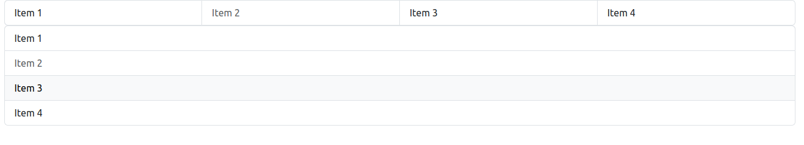

Código:

```html

<div class="container">
    <!-- APLICANDO list-group-horizontal -->
    <div class="list-group list-group-horizontal">
        <a href="#" class="list-group-item list-group-item-action">Item 1</a>
        <a href="#" class="list-group-item list-group-item-action disabled">Item 2</a>
        <a href="#" class="list-group-item list-group-item-action">Item 3</a>
        <a href="#" class="list-group-item list-group-item-action">Item 4</a>
    </div>
    <!-- SEM list-group-horizontal -->
    <div class="list-group">
        <a href="#" class="list-group-item list-group-item-action">Item 1</a>
        <a href="#" class="list-group-item list-group-item-action disabled">Item 2</a>
        <a href="#" class="list-group-item list-group-item-action">Item 3</a>
        <a href="#" class="list-group-item list-group-item-action">Item 4</a>
    </div>
</div>

```

## Aplicando cores

> A logica e a mesma no que ja vimos.

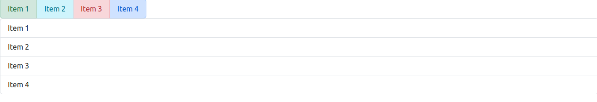

Código:

```html

<div class="container">
    <!-- APLICANDO CORES -->
    <div class="list-group list-group-horizontal">
        <a href="#" class="list-group-item list-group-item-success">Item 1</a>
        <a href="#" class="list-group-item list-group-item-info">Item 2</a>
        <a href="#" class="list-group-item list-group-item-danger">Item 3</a>
        <a href="#" class="list-group-item list-group-item-primary">Item 4</a>
    </div>
    <!-- SEM CORES -->
    <div class="list-group">
        <a href="#" class="list-group-item list-group-item-action">Item 1</a>
        <a href="#" class="list-group-item list-group-item-action">Item 2</a>
        <a href="#" class="list-group-item list-group-item-action">Item 3</a>
        <a href="#" class="list-group-item list-group-item-action">Item 4</a>
    </div>
</div>

```


# Bootstrap - Páginação


Código:

```html

<nav aria-label="Page navigation example">
  <ul class="pagination">
    <li class="page-item"><a class="page-link" href="#">Previous</a></li>
    <li class="page-item"><a class="page-link" href="#">1</a></li>
    <li class="page-item"><a class="page-link" href="#">2</a></li>
    <li class="page-item"><a class="page-link" href="#">3</a></li>
    <li class="page-item"><a class="page-link" href="#">Next</a></li>
  </ul>
</nav>

```

## `Disabled` e `active`


Código:

```html
<nav aria-label="...">
  <ul class="pagination">
    <li class="page-item disabled">
      <a class="page-link">Previous</a>
    </li>
    <li class="page-item"><a class="page-link" href="#">1</a></li>
    <li class="page-item active" aria-current="page">
      <a class="page-link" href="#">2</a>
    </li>
    <li class="page-item"><a class="page-link" href="#">3</a></li>
    <li class="page-item">
      <a class="page-link" href="#">Next</a>
    </li>
  </ul>
</nav>
```

## Tamanhos

- **pagination-lg**

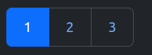

Código:

```html

<nav aria-label="...">
  <ul class="pagination pagination-lg">
    <li class="page-item active" aria-current="page">
      <span class="page-link">1</span>
    </li>
    <li class="page-item"><a class="page-link" href="#">2</a></li>
    <li class="page-item"><a class="page-link" href="#">3</a></li>
  </ul>
</nav>

```

- **pagination-sm**

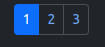

Código:

```html

<nav aria-label="...">
  <ul class="pagination pagination-sm">
    <li class="page-item active" aria-current="page">
      <span class="page-link">1</span>
    </li>
    <li class="page-item"><a class="page-link" href="#">2</a></li>
    <li class="page-item"><a class="page-link" href="#">3</a></li>
  </ul>
</nav>

```

## breadcrumb

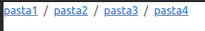

Código:

```html

<nav aria-label="...">
    <ul class="breadcrumb">
        <li class="breadcrumb-item"><a href="#">pasta1</a></li>
        <li class="breadcrumb-item"><a href="#">pasta2</a></li>
        <li class="breadcrumb-item"><a href="#">pasta3</a></li>
        <li class="breadcrumb-item"><a href="#">pasta4</a></li>
    </ul>
</nav>
```


# Bootstrap - Nav

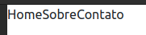

Código:

```html
<ul class="nav">
    <li class="nav-item">Home</li>
    <li class="nav-item">Sobre</li>
    <li class="nav-item">Contato</li>
</ul>
```

> esta sem formatação (e normal)

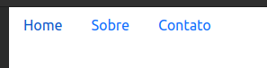

Código:

```html
<ul class="nav">
    <li class="nav-item"><a href="#" class="nav-link">Home</a></li>
    <li class="nav-item"><a href="#" class="nav-link">Sobre</a></li>
    <li class="nav-item"><a href="#" class="nav-link">Contato</a></li>
</ul>
```

> agora sim!

## `nav-tabs`


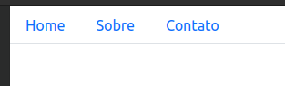

Código:

```html
<ul class="nav nav-tabs">
    <li class="nav-item"><a href="#" class="nav-link">Home</a></li>
    <li class="nav-item"><a href="#" class="nav-link">Sobre</a></li>
    <li class="nav-item"><a href="#" class="nav-link">Contato</a></li>
</ul>
```

- **ativo e desativo**

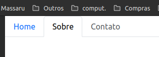

Código:

```html
<ul class="nav nav-tabs">
    <li class="nav-item"><a href="#" class="nav-link">Home</a></li>
    <li class="nav-item"><a href="#" class="nav-link active">Sobre</a></li>
    <li class="nav-item"><a href="#" class="nav-link disabled">Contato</a></li>
</ul>
```

## `nav-pills`

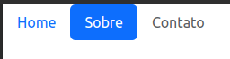

Código:

```html
<ul class="nav nav-pills">
    <li class="nav-item"><a href="#" class="nav-link">Home</a></li>
    <li class="nav-item"><a href="#" class="nav-link active">Sobre</a></li>
    <li class="nav-item"><a href="#" class="nav-link disabled">Contato</a></li>
</ul>
```

## `nav-justified`


Código:

```html
<ul class="nav nav-pills nav-justified">
    <li class="nav-item"><a href="#" class="nav-link">Home</a></li>
    <li class="nav-item"><a href="#" class="nav-link active">Sobre</a></li>
    <li class="nav-item"><a href="#" class="nav-link disabled">Contato</a></li>
</ul>
```
## `tab-content`


- **nav-tabs**


Código:

```html
<ul class="nav nav-tabs nav-justified">
    <li class="nav-item"><a href="#home" class="nav-link active" data-bs-toggle="tab">Home</a></li>
    <li class="nav-item"><a href="#sobre" class="nav-link" data-bs-toggle="tab">Sobre</a></li>
    <li class="nav-item"><a href="#contato" class="nav-link" data-bs-toggle="tab">Contato</a></li>
</ul>
<div class="tab-content">
    <div id="home" class="tab-pane active"><h1>Home</h1></div>
    <div id="sobre" class="tab-pane fade"><h1>Sobre</h1></div>
    <div id="contato" class="tab-pane fade"><h1>Contato</h1></div>
</div>
```

- **nav-pills**


Código:

```html
<ul class="nav nav-pills nav-justified">
    <li class="nav-item"><a href="#home" class="nav-link active" data-bs-toggle="tab">Home</a></li>
    <li class="nav-item"><a href="#sobre" class="nav-link" data-bs-toggle="tab">Sobre</a></li>
    <li class="nav-item"><a href="#contato" class="nav-link" data-bs-toggle="tab">Contato</a></li>
</ul>
<div class="tab-content">
    <div id="home" class="tab-pane active"><h1>Home</h1></div>
    <div id="sobre" class="tab-pane fade"><h1>Sobre</h1></div>
    <div id="contato" class="tab-pane fade"><h1>Contato</h1></div>
</div>
```

# Barra de navegação - `navbar`

## Padrão

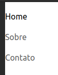

Código:

```html
<nav class="navbar">
    <ul class="navbar-nav">
        <li class="nav-item"><a href="#home" class="nav-link active" data-bs-toggle="tab">Home</a></li>
        <li class="nav-item"><a href="#sobre" class="nav-link" data-bs-toggle="tab">Sobre</a></li>
        <li class="nav-item"><a href="#contato" class="nav-link" data-bs-toggle="tab">Contato</a></li>
    </ul>
</nav>
```

## Deixando barra na horizontal - `navbar-expand`


Código:

```html
<nav class="navbar navbar-expand-md">
    <ul class="navbar-nav">
        <li class="nav-item"><a href="#home" class="nav-link active" data-bs-toggle="tab">Home</a></li>
        <li class="nav-item"><a href="#sobre" class="nav-link" data-bs-toggle="tab">Sobre</a></li>
        <li class="nav-item"><a href="#contato" class="nav-link" data-bs-toggle="tab">Contato</a></li>
    </ul>
</nav>
```

* **Tamanho que realizara a quebra de texto**
    - `navbar-expand-sm`
    - `navbar-expand-md`
    - `navbar-expand-lg`

> podemos alterar cor das letras usando classe do bootstrap (`navbar-dark`) e aplicar posicionamento dos elementos com flex. Caso queira alterar cor de fundo pode ser usado o `bg` do bootstrap.


## Logo - `navbar-brand`

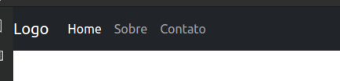

Código:

```html
<nav class="navbar bg-dark navbar-expand-md navbar-dark">
    <div class="navbar-brand">Logo</div>
    <ul class="navbar-nav">
        <li class="nav-item"><a href="#home" class="nav-link active" data-bs-toggle="tab">Home</a></li>
        <li class="nav-item"><a href="#sobre" class="nav-link" data-bs-toggle="tab">Sobre</a></li>
        <li class="nav-item"><a href="#contato" class="nav-link" data-bs-toggle="tab">Contato</a></li>
    </ul>
</nav>
```
## Barra de navegação para mobile - barra expansiva


Código:

```html
<nav class="navbar bg-dark navbar-expand-md navbar-dark">
    <div class="navbar-brand">Logo</div>

    <button class="navbar-toggler" type="button" data-bs-toggle="collapse" data-bs-target="#myNav">
        <span class="navbar-toggler-icon"></span>
    </button>
    <div id="myNav" class="collapse navbar-collapse">
        <ul class="navbar-nav">
            <li class="nav-item"><a href="#home" class="nav-link active" data-bs-toggle="tab">Home</a></li>
            <li class="nav-item"><a href="#sobre" class="nav-link" data-bs-toggle="tab">Sobre</a></li>
            <li class="nav-item"><a href="#contato" class="nav-link" data-bs-toggle="tab">Contato</a></li>
        </ul>
    </div>
</nav>
```
# Bootstrap - carrossel

## Carousel autoplay


Código:

```html
<div id="meuCarrocel" class="carousel slide" data-bs-ride="carousel">
    <!-- dentro da div abaixo, e onde fica nosso conteúdo -->
    <div class="carousel-inner">
        <div class="carousel-item active">
            <div class="bg-secondary text-bg-dark d-flex justify-content-center align-items-center mmh-h300">
                Conteúdo 1
            </div>
        </div>
        <div class="carousel-item">
            <div class="bg-warning text-bg-light d-flex justify-content-center align-items-center mmh-h300">
                Conteúdo 2
            </div>
        </div>
        <div class="carousel-item">
            <div class="bg-danger text-bg-dark d-flex justify-content-center align-items-center mmh-h300">
                Conteúdo 3
            </div>
        </div>
    </div>

</div>
```

## Indicadores do carrossel - `carousel-indicators`


Código:

```html
<div id="meuCarrocel" class="carousel slide" data-bs-ride="carousel">
    <!-- dentro da ul abaixo, e onde fica nosso indicators -->
    <ul class="carousel-indicators">
        <li data-bs-target="#meuCarrocel" data-bs-slide-to="0" class="active"></li>
        <li data-bs-target="#meuCarrocel" data-bs-slide-to="1"></li>
        <li data-bs-target="#meuCarrocel" data-bs-slide-to="2"></li>
    </ul>
    <div class="carousel-inner">
        <div class="carousel-item active">
            <div class="bg-secondary text-bg-dark d-flex justify-content-center align-items-center mmh-h300">
                Conteúdo 1
            </div>
        </div>
        <div class="carousel-item">
            <div class="bg-warning text-bg-light d-flex justify-content-center align-items-center mmh-h300">
                Conteúdo 2
            </div>
        </div>
        <div class="carousel-item">
            <div class="bg-danger text-bg-dark d-flex justify-content-center align-items-center mmh-h300">
                Conteúdo 3
            </div>
        </div>
    </div>
    

</div>
```
## Controladores do carrossel - `carousel-control`


Código:

```html
<div id="meuCarrocel" class="carousel slide" data-bs-ride="carousel">
    <ul class="carousel-indicators">
        <li data-bs-target="#meuCarrocel" data-bs-slide-to="0" class="active"></li>
        <li data-bs-target="#meuCarrocel" data-bs-slide-to="1"></li>
        <li data-bs-target="#meuCarrocel" data-bs-slide-to="2"></li>
    </ul>
    <div class="carousel-inner">
        <div class="carousel-item active">
            <div class="bg-secondary text-bg-dark d-flex justify-content-center align-items-center mmh-h300">
                Conteúdo 1
            </div>
        </div>
        <div class="carousel-item">
            <div class="bg-warning text-bg-light d-flex justify-content-center align-items-center mmh-h300">
                Conteúdo 2
            </div>
        </div>
        <div class="carousel-item">
            <div class="bg-danger text-bg-dark d-flex justify-content-center align-items-center mmh-h300">
                Conteúdo 3
            </div>
        </div>
    </div>
    <!-- As tags `a` abaixo sao nossos controladores -->
    <a class="carousel-control-prev" href="#meuCarrocel" data-bs-slide="prev">
        <span class="carousel-control-prev-icon"></span>
    </a>
    <a class="carousel-control-next" href="#meuCarrocel" data-bs-slide="next">
        <span class="carousel-control-next-icon"></span>
    </a>
</div>
```

<!-- TODO terminado @hagiomassaru -->