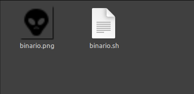
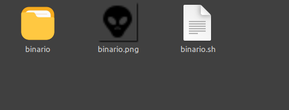
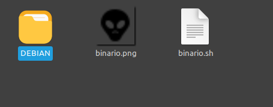
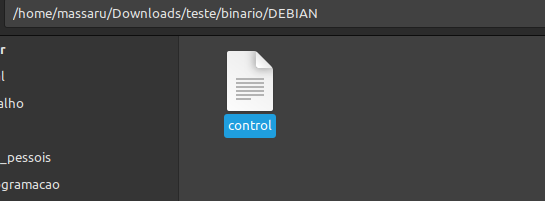
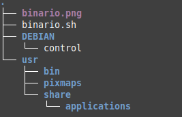

# Criando um pacote .deb

Pacotes .deb sao um tipo de empacotamento para facilitar e padronizar a instalação de programas no Debian e seus derivados. Da mesma forma que temos os instaladores .exe no windows, no Debian/Ubuntu temos os "instaladores" .deb.

Esse tipo de empacotamento e uma dar formas padrões de distribuição de softwares.


## Começando

Para isso precisamos do binário do programa (Que seria o programa compilado) e uma imagem para servir como ícone.



Agora criamos um diretório com um nome do binário (programa)



coloquemos todos os aquivos dentro do diretório que acabamos de criar


La dentro criaremos um novo diretório como o nome `DEBIAN` (tudo em maiúsculo mesmo)



Dentro do diretório `DEBIAN` iremos criar um arquivo sem extensão chamado `control`



Iremos abri-lo como um editor de texto de sua preferencia e adicionar o texto a seguir:

```
Package:NomeDoPacote
Version: 0.1
Priority: optional
Architecture: all (amd64,x86 e etc)
Depends: Dependências
Installed-Size: Tamanho da instalacao
Maintainer: Marcos da B. M. Oliveira <email@email.com>(nome e email do autor do projeto)
Homepage: http://www.fulano.com/
Description: Descrição do projeto
```
O texto acima voce pode preencher ou deixar vazio o campo caso queira, sendo obrigatório a preenchimento dos campos Package,Version,Architecture,Maintainer e Description


```
Package:NomeDoPacote <<Obrigatório
Version: 0.1 <<Obrigatório
Priority:
Architecture: all <<Obrigatório
Depends: 
Installed-Size:
Maintainer: Marcos da B. M. Oliveira <email@email.com>(nome e email do autor do projeto) <<Obrigatório
Homepage:
Description: Descrição do projeto <<Obrigatório
```

Apos ter preenchido saia do diretório `DEBIAN`

## Estrutura de instalação

Bom, agora iremos entender como funcionara de agora em diante. Tudo que estiver nesta pasta que estamos (fora a pasta `DEBIAN`) sera colocado na raiz do sistema do cliente que instalar esse pacote. Obviamente nao precisamos instalar na raiz, sendo assim iremos criar uma estrutura de diretórios que refletira (ou quase) a onde ele deve ser instala. Com isso tenho uma sugestão de estrutura diretórios que o DEBIAN e Ubuntu utilizam.

1. Cria uma pasta chamado `usr`

2. Dentro desta pasta iremos criar o diretório `bin` (para armazenar o binário), a pasta `share`e dentro dela a pasta `applications` dentro dela

3. Voltando ao diretorio `usr` iremos criar um novo diretorio chamado `pixmaps`


Exemplo de estrutura



## Arrumando a bagunça

Agora iremos colocar cada arquivo em seu lugar. 

- `binario.sh` -> tire a extencao do binario renomeando o mesma para `binario`. E Coloque na pasta `usr/bin`
- `binario.png` -> Coloque na pasta `usr/pixmaps`


