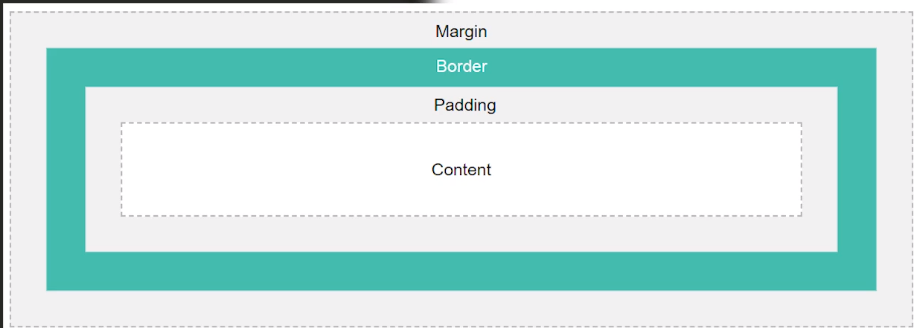
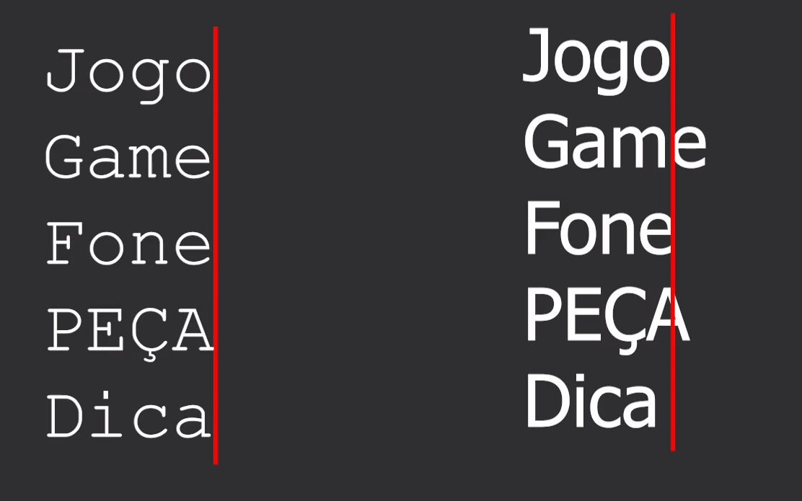
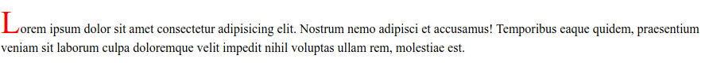

# CSS

## [Voltar ao arquivo README.md](/README.md)

## Tipos de declaração em CSS

* CSS inline - declaração de css na tag utilizando propriedade `style`
```html
<!-- exemplo -->
<p style="color:red;"> texto </p>
```
* CSS interno - declaração de css no arquivo utilizando a tag `<style>`
```html
<!-- exemplo -->
<style>
    p{
        color:red;
    }
</style>
```
* CSS externo - declaração de css em outro arquivo utilizando a tag `<link>`
```html
<link href="arquivo_com_css.css" rel="stylesheet">
```

## Trocando a cor e modificando o plano de fundo de um Elemento HTML - background

### Adicionar imagem de fundo
- `background-image: url('URL')|none|initial|inherit;`
    * `url ('URL')` -> O URL da imagem. Para especificar mais de uma imagem, separe os URLs com uma vírgula
    * `none` -> Nenhuma imagem de plano de fundo será exibida. Isso é padrão
    * `initial` -> Define essa propriedade para o seu valor padrão https://www.w3schools.com/cssref/css_initial.asp
    * `inherit` -> Herdará essa propriedade do seu elemento pai https://www.w3schools.com/cssref/css_inherit.asp   

### Posicionando imagem de fundo
- `background-position: value;`
    * /* Valores chave */
        * `background-position: top;`
        * `background-position: bottom;`
        * `background-position: left;`
        * `background-position: right;`
        * `background-position: center;`

    * /* Valores <percentuais> */
        * `background-position: 25% 75%;`

    * /* valores <espessura> */
        * `background-position: 0 0;`
        * `background-position: 1cm 2cm;`
        * `background-position: 10ch 8em;`

    * /* Multiplas imagens */
        * `background-position: 0 0, center;`

    * /* Valores de cantos relativos */
        * `background-position: bottom 10px right 20px;`
        * `background-position: right 3em bottom 10px;`
        * `background-position: bottom 10px right;`
        * `background-position: top right 10px;`

    * /* Valores globais */
        *`background-position: inherit;`
        *`background-position: initial;`
        *`background-position: unset;`
### Definir repetição 
- `background-repeat: repeat|repeat-x|repeat-y|no-repeat|initial|inherit;`
    * `repeat` -> A imagem de fundo é repetida na vertical e na horizontal.  A última imagem será cortada se não couber. Este é o padrão
    * `repeat-`x` -> A imagem de plano de fundo é repetida apenas horizontalmente
    * `repeat-y` -> A imagem de plano de fundo é repetida apenas verticalmente
    * `no-repeat` -> A imagem de fundo não se repete. A imagem será exibida apenas uma vez
    * `space` -> A imagem de fundo é repetida o máximo possível sem recorte. A primeira e a última imagem são fixadas em ambos os lados do elemento, e o espaço em branco é distribuído uniformemente entre as imagens
    * `round` -> A imagem de fundo é repetida e esmagada ou esticada para preencher o espaço (sem lacunas)
    * `initial` -> Define essa propriedade para o valor padrão.
    * `inherit` -> Herda essa propriedade do seu elemento pai.

### Propriedade que especifica o tamanho das imagens de fundo.
- `background-size: auto|length|cover|contain|initial|inherit;`
    * `auto` -> valor padrão. A imagem de plano de fundo é exibida em seu tamanho original    
    * `length` -> Define a largura e a altura da imagem de plano de fundo. O primeiro valor define a largura, o segundo valor define a altura. Se apenas um valor for fornecido, o segundo será definido como "automático". Leia sobre unidades de comprimento
    * `percentage` -> Define a largura e a altura da imagem de plano de fundo em porcentagem do elemento pai. O primeiro valor define a largura, o segundo valor define a altura. Se apenas um valor for fornecido, o segundo será definido como "auto"
    * `cover` -> Redimensione a imagem de plano de fundo para cobrir todo o contêiner, mesmo que precise esticar a imagem ou cortar um pouco uma das bordas
    * `contain` -> Redimensione a imagem de plano de fundo para garantir que a imagem esteja totalmente visível
    * `initial` -> Define essa propriedade para o valor padrão.
    * `inherit` -> Herda essa propriedade do seu elemento pai.
    
### Comportamento de rolamento
- `background-attachment: scroll|fixed|local|initial|inherit;`
    * `scroll` -> A imagem de plano de fundo rolará com a página. Isso é padrão
    * `fixed` -> A imagem de plano de fundo não rola com a página
    * `local` -> A imagem de plano de fundo rolará com o conteúdo do elemento
    * `initial` -> Define essa propriedade para o valor padrão.
    * `inherit` -> Herda essa propriedade do seu elemento pai.
    
## Margem - margin
### Definir margem do elemento
- `margin: 10px (comprimento)|auto|initial|inherit;` -> pode usar margin-top entre outros
    * `auto` -> O navegador calcula uma margem
    * `initial` -> Define essa propriedade para o seu valor padrão https://www.w3schools.com/cssref/css_initial.asp
    * `inherit` -> Herdará essa propriedade do seu elemento pai https://www.w3schools.com/cssref/css_inherit.asp    
    * Todos os elementos margin usam as propriedades acima.
- `margin-bottom: (comprimento)|auto|initial|inherit;` -> Define a margem inferior de um elemento
- `margin-left: (comprimento)|auto|initial|inherit;` -> Define a margem esquerda de um elemento
- `margin-right: (comprimento)|auto|initial|inherit;` -> Define a margem direita de um elemento
- `margin-top: (comprimento)|auto|initial|inherit;` -> Define a margem superior de um elemento
    
## Preenchimento - padding

### Definir o preenchimento do elemento
- `padding: 10px 5px 15px 20px;` -> Se a propriedade de padding tiver quatro valores
    * O preenchimento superior é 10px
    * O preenchimento direito é 5px
    * O preenchimento inferior é de 15px
    * O preenchimento esquerdo é de 20px
- `padding: 10px 5px 15px;` -> Se a propriedade de padding tiver três valores
    * O preenchimento superior é 10px
    * O preenchimento direito e esquerdo são 5px
    * O preenchimento inferior é de 15px    
- `padding: 10px 5px 15px;` -> Se a propriedade de padding tiver dois valores
    * O preenchimento superior e inferior são 10px
    * O preenchimento direito e esquerdo são 5px
- `padding: 10px;` -> Se a propriedade de padding tiver um valor
    * todos os quatro preenchimento são 10px    
- `padding-bottom: length(comprimento)|initial|inherit;` /* essas propriedades sao bem parecidas com margin */
- `padding-left: length(comprimento)|initial|inherit;`
- `padding-right: length(comprimento)|initial|inherit;`
- `padding-top: length(comprimento)|initial|inherit;`    


## Borda - border
### Arredondamento dos cantos da borda
- `border-radius: 5px;`
### Estilo de borda
- `border-style: dotted|dashed|solid|none|hidden;`
    * `dotted` -> borda  pontilhada
    * `dashed` -> borda continua
    * `solid` -> borda inexistente
    * `none` -> borda invisível
    * `hidden` -> definição de borda em uma linha só

### Cor de borda
- `border-color: color|transparent|initial|inherit;`
    * `color` -> Especifica a cor da borda. Consulte os valores de cores CSS para obter uma lista completa dos possíveis valores de cores. A cor padrão é a cor atual do elemento
    * `transparent` -> Especifica que a cor da borda deve ser transparente
### Uma propriedade de taquigrafia para largura de borda, estilo de borda e cor de borda
- `border: 1px solid gray;`/* tamanho / style / cor */




## Id e classes
```css
.algumacoisa{
    /* classe */
    /* são identificações que podem ser reutilizadas */
}
#algumacoisa{
    /* Id */
    /* são identificações que não podem ser reutilizadas */

}

```

```html
<tag id="algumacoisa">/progbr</tag>
<tag class="algumacoisa">/progrbr</tag>

```
## Formatação de link's
```css
link{
    /* formatação do link */
}
link:visited{
    /* formatação de link visitado */
}

```
## Ajustes no texto

### Cor de fonte
- `color: color|initial|inherit;`
#### Tipos de cores
- Hexadecimal Colors
    * Uma cor hexadecimal é especificada com: #RRGGBB, onde os números inteiros hexadecimais RR (vermelho), GG (verde) e BB (azul) especificam os componentes da cor. Todos os valores devem estar entre 00 e FF
```css
#p1 {background-color: #ff0000;}   /* red */
#p2 {background-color: #00ff00;}   /* green */
#p3 {background-color: #0000ff;}   /* blue */
```
- Hexadecimal colors com transparencia
    * Uma cor hexadecimal é especificada com: #RRGGBB. Para adicionar transparência, adicione dois dígitos adicionais entre 00 e FF
```css
#p1a {background-color: #ff000080;}   /* red transparency */
#p2a {background-color: #00ff0080;}   /* green transparency */
#p3a {background-color: #0000ff80;}   /* blue transparency */
```
- RGB Colors
    * Um valor de cor RGB é especificado com a função rgb (), que possui a seguinte sintaxe : `rgb(vermelho, verde, azul)`
```css
#p1 {background-color: rgb(255, 0, 0);}   /* red */
#p2 {background-color: rgb(0, 255, 0);}   /* green */
#p3 {background-color: rgb(0, 0, 255);}   /* blue */
```
- RGBA Colors (RGB com transparencia)
    * Os valores de cores RGBA são uma extensão dos valores de cores RGB com um canal alfa - que especifica a opacidade do objeto. Uma cor RGBA é especificada com a função rgba(), que possui a seguinte sintaxe : `rgba(vermelho, verde, azul, alfa)`
```css
#p1 {background-color: rgba(255, 0, 0, 0.3);}   /* red with opacity */
#p2 {background-color: rgba(0, 255, 0, 0.3);}   /* green with opacity */
#p3 {background-color: rgba(0, 0, 255, 0.3);}   /* blue with opacity */
```

### alinhamento de texto/elemento
- `text-align: auto|left|right|center|justify|start|end|initial|inherit;`
    * `auto` -> Valor padrão. A última linha é justificada e alinhada à esquerda	
    * `left` -> A última linha está alinhada à esquerda	
    * `right` -> A última linha está alinhada à direita	
    * `center` -> A última linha está alinhada no centro	
    * `justify` -> A última linha é justificada como o resto das linhas	
    * `start` -> A última linha está alinhada no início da linha (esquerda se a direção do texto for esquerda para direita e direita a direção do texto for direita para esquerda)	
    * `end` -> A última linha está alinhada no final da linha (à direita, se a direção do texto for da esquerda para a direita e a esquerda for a direção do texto da direita para a esquerda)	
    * `initial` -> Define essa propriedade para o seu valor padrão.	
    * `inherit` -> Herdará essa propriedade do seu elemento pai.
### transformação de texto/elemento
- `text-transform: none|capitalize|uppercase|lowercase|initial|inherit;`
    * `none` -> Sem capitalização. O texto é renderizado como está. Isso é padrão	
    * `capitalize` -> Transforma o primeiro caractere de cada palavra para maiúsculas	
    * `uppercase` -> Transforma todos os caracteres para maiúsculas	
    * `lowercase` -> Transforma todos os caracteres para minúsculas	
    * `initial` -> Define essa propriedade para o seu valor padrão.	
    * `inherit` -> Herdeira essa propriedade do seu elemento pai.
### Indentação do texto/elemento
- `text-indent: 50px;`
### Decoração de texto/elemento
- `text-decoration: text-decoration-line text-decoration-color text-decoration-style|initial|inherit;`

- `text-decoration-line: none|underline|overline|line-through|initial|inherit;` -> O text-decoration-line propriedade define o tipo de decoração de texto a ser usada
    * `none` -> Valor padrão. Não especifica nenhuma linha para a decoração do texto	
    * `underline` -> Especifica que uma linha será exibida no texto	
    * `overline` -> Especifica que uma linha será exibida sobre o texto	
    * `line-through` -> Especifica que uma linha será exibida através do texto	
    * `initial` -> Define essa propriedade para o seu valor padrão.
    * `inherit` -> Herdará essa propriedade do seu elemento pai.
- `text-decoration-color: color|initial|inherit;` -> A propriedade text-decoration-color especifica a cor da decoração do texto
- `text-decoration-style: solid|double|dotted|dashed|wavy|initial|inherit;` -> A propriedade text-decoration-style define o estilo da decoração do texto
    * `solid` -> Valor padrão. A linha será exibida como uma única linha	
    * `double` -> A linha será exibida como uma linha dupla	
    * `dotted` -> A linha será exibida como uma linha pontilhada	
    * `dashed` -> A linha será exibida como uma linha tracejada	
    * `wavy` -> A linha será exibida como uma linha ondulada	
    * `initial` -> Define essa propriedade para o seu valor padrão.	
    * `inherit` -> Herdará essa propriedade do seu elemento pai.
###  Espaço entre as letras 
- `letter-spacing: normal|length|initial|inherit;`
    * `normal` -> Não há espaço extra entre os personagens. Este é o padrão
    * `length` -> Define um espaço extra entre os caracteres (valores negativos são permitidos).
###  Espaço entre as palavras 
- `word-spacing: normal|length|initial|inherit;`
    * `normal` -> Não há espaço extra entre os personagens. Este é o padrão
    * `length` -> Define um espaço extra entre os caracteres (valores negativos são permitidos).
###  Espaço entre as linhas 
- `line-height: normal|number|length|initial|inherit;`
    * `normal` -> Não há espaço extra entre os personagens. Este é o padrão
    * `number` -> Um número que será multiplicado pelo tamanho da fonte atual para definir a altura da linha
    * `length` -> Define um espaço extra entre os caracteres (valores negativos são permitidos).
### Sombra do texto/elemento
- `text-shadow: h-shadow v-shadow blur-radius color|none|initial|inherit;` 
    * `h-shadow` -> necessária. A posição da sombra horizontal. Valores negativos são permitidos
    * `v-shadow` -> Required. A posição da sombra vertical. Valores negativos são permitidos
    * `blur-radius` -> opcional. O raio de desfoque. O valor padrão é 0
    * `color` -> opcional. A cor da sombra. Veja os valores de cores CSS para obter uma lista completa dos possíveis valores de cores
    * `none` -> valor padrão. Sem sombra
### Sombra do elemento
- `box-shadow: none|h-offset v-offset blur spread color |inset|initial|inherit;`
    * `none` -> Valor padrão. Nenhuma sombra é exibida	
    * `h-offset` -> Necessário. O deslocamento horizontal da sombra. Um valor positivo coloca a sombra no lado direito da caixa, um valor negativo coloca a sombra no lado esquerdo da caixa	
    * `v-offset` -> Necessário. O deslocamento vertical da sombra. Um valor positivo coloca a sombra abaixo da caixa, um valor negativo coloca a sombra acima da caixa	
    * `blur` -> Opcional. O raio de desfoque. Quanto maior o número, mais turva será a sombra	
    * `spread` -> Opcional. O raio de propagação. Um valor positivo aumenta o tamanho da sombra, um valor negativo diminui o tamanho da sombra	
    * `color` -> Opcional. A cor da sombra. O valor padrão é a cor do texto. Olhe para Valores de cores CSS para uma lista completa dos possíveis valores de cores. Nota: No Safari (no PC), o parâmetro color é necessário. Se você não especificar a cor, a sombra não será exibida.	
    * `inset` -> Opcional. Muda a sombra de uma sombra externa (saída) para uma sombra interna	
    * `initial` -> Define essa propriedade para o seu valor padrão.
    * `inherit` -> Herdará essa propriedade do seu elemento pai.

## Alterando cursor no elemento
- `cursor: value;` -> A propriedade do `cursor` especifica o cursor do mouse a ser exibido ao apontar sobre um elemento.
    
    /* Keywords */
    * `cursor: pointer;`
    * `cursor: auto;`

    /* Usando URL e cordenadas */
    * `cursor:  url(cursor1.png) 4 12, auto;`
    * `cursor:  url(cursor2.png) 2 2, pointer;`

    /* Valores globais */
    * `cursor: inherit;`
    * `cursor: initial;`
    * `cursor: unset;`

    [Mais informacoes](https://developer.mozilla.org/pt-BR/docs/Web/CSS/cursor)

## Unidades medida fixas

* `cm` = centímetro
* `mm` = milímetro
* `in` = polegada
* `px` = pixel
* `pt` = ponto
* `pc` = picas

## Unidades medida relativa

* `em` = elemento herdara tamanho da fonte 'pai'
* `rem` = elemento herdara tamanho da fonte raiz (hedara o tamanho do body)
* `vw` = refere a largura da janela ex: `50vw` → equivale ao largura de 50% da janela.
* `vh` = refere a altura da janela ex: `50vh` → equivale ao altura de 50% da janela.
* `vmin` = refere a menor dimensão
* `vmax` = refere a maior dimensão
* `%` = sempre vai se referir ao tamanho do elemento pai.

## Elementos de fontes


### Familia fonte 
- `font-family: family-name|generic-family|initial|inherit;` -> Uma lista priorizada de nomes de família de fontes e / ou nomes de família genéricos
    * Ex: `font-family: "Times New Roman", Times, serif;`
### Tipo de fonte
- `font-style: normal|italic|oblique|initial|inherit;`
    * `normal` -> O navegador exibe um estilo de fonte normal. Este é o padrão
    * `italic` -> O navegador exibe um estilo de fonte itálico
    * `oblique` -> O navegador exibe um estilo de fonte oblíquo

### Largura da Linha
- `font-weight: normal|bold|bolder|lighter|number|initial|inherit;`
    * `normal` -> Define caracteres normais. Este é o padrão
    * `bold` -> Define caracteres grossos
    * `bolder` -> Define caracteres mais espessos
    * `lighter` -> Define caracteres mais leves
    * `number` / `100` ate `900` -> Define de caracteres finos a grossos. 400 é o mesmo que o normal e 700 é o mesmo que negrito
### Variante de fonte
- `font-variant: normal|small-caps|initial|inherit;`
    * `normal` -> O navegador exibe uma fonte normal. Isso é padrão	
    * `small-caps` -> O navegador exibe uma fonte de letras pequenas
### tamanho da fonte
- `font-size:medium|xx-small|x-small|small|large|x-large|xx-large|smaller|larger|length|initial|inherit;`
    * `medium` -> Define o tamanho da fonte para um tamanho médio. Este é o padrão
    * `xx-small` -> Define o tamanho da fonte para um tamanho xx-small
    * `x-small` -> Define o tamanho da fonte para um tamanho extra pequeno
    * `small` -> Define o tamanho da fonte para um tamanho pequeno
    * `large` -> Define o tamanho da fonte para um tamanho grande
    * `x-large` -> Define o tamanho da fonte para um tamanho extra grande
    * `xx-large` -> Define o tamanho da fonte para um tamanho xx-largo
    * `smaller` -> Define o tamanho da fonte para um tamanho menor que o elemento pai
    * `larger` -> Define o tamanho da fonte para um tamanho maior que o elemento pai
    * `length` -> Define o tamanho da fonte para um tamanho fixo em px, cm, etc. Leia sobre unidades de comprimento


## Fontes com serifa e sem serifa / Fonte Monospace



## Elementos Lista

### Formatação dos pinos da lista (não ordenadas)
- `list-style-type: value;`
    * `none` -> Nenhum
    * `disk` -> Disco 
    * `circle` -> Circulo
    * `square` -> Quadrado
### Possição da pinagem
- `list-style-position: inside|outside|initial|inherit;`
    * `inside` -> Os pontos de marcador estarão dentro do item de lista
    * `outside` -> Os pontos de marcador estarão fora do item da lista. Isso é padrão
    * `initial` -> Define essa propriedade para o seu valor padrão.
    * `inherit` -> Herdará essa propriedade do seu elemento pai.

### Definir imagem como pinagem
- `list-style-image: none|url|initial|inherit;` Ex: `list-style-image: url(./images/certo.png);`
    * `none` -> Nenhuma imagem será exibida. Em vez disso, a propriedade `list-style-type` definirá que tipo de marcador de lista será renderizado. Este é o padrão
    * `url` -> O caminho para a imagem a ser usada como marcador de item de lista

### Formatação de pinos da lista (Ordenada) 
- `list-style-type: value|lower-roman|lower-alpha|upper-roman|upper-alpha;`
    * `lower-roman` -> numero romanos minúsculo */
    * `lower-alpha` -> numero alfa numérico minúsculo */
    * `upper-roman` -> numero romanos maiúsculo */
    * `upper-alpha` -> numero alfa numérico maiúsculo */

## Display

```css
/* Exibe um elemento como um elemento embutido (como <span>). Quaisquer propriedades de altura e largura não terão efeito */
display: inline;
/* Exibe um elemento como um elemento de bloco (como <p>). Ele começa em uma nova linha e ocupa toda a largura */
display: block;
/* Exibe um elemento como um contêiner de bloco de nível embutido. O próprio elemento é formatado como um elemento embutido, mas você pode aplicar valores de altura e largura */
display: inline-block;
/* O elemento foi completamente removido */
display: none;
```

## Overflow - Conteudo transbordado

Esta propriedade especifica se é necessário cortar o conteúdo ou adicionar barras de rolarem quando o conteúdo de um elemento é muito grande para caber em uma área especificada.
Nota: a `overflow` propriedade só funciona para elementos de bloco com uma altura especificada.

```css
div.ex1 {
  overflow: scroll;
  /* O estouro é cortado, mas uma barra de rolagem é adicionada para ver o resto do conteúdo */
}

div.ex2 {
  overflow: hidden;
  /* O estouro é cortado e o resto do conteúdo ficará invisível */
}

div.ex3 {
  overflow: auto;
  /* Se o estouro for cortado, uma barra de rolagem deve ser adicionada para ver o resto do conteúdo */
}

div.ex4 {
  overflow: visible;
  /* O estouro não é cortado. Ele é renderizado fora da caixa do elemento. Este é o padrão */
}

```

## Position

A propriedade `position` especifica o tipo de método de posicionamento usado para um elemento (static, relative, absolute, fixed, ou sticky).

### CSS Syntax
```css
position: static|absolute|fixed|relative|sticky|initial|inherit;
```
### Valores de propriedade


```css
div#myDIV {
    /* Valor padrão. Os elementos são renderizados em ordem, conforme aparecem no fluxo do documento */
    position:static;
}
div#myDIV {
    /* O elemento é posicionado em relação à sua posição normal, então "esquerda: 20px" adiciona 20 pixels à posição ESQUERDA do elemento */
    position:relative;
}
div#myDIV {
    /* O elemento é posicionado em relação ao primeiro elemento ancestral posicionado (não estático) */
    position:absolute;
}
div#myDIV {
    /* O elemento está posicionado em relação à janela do navegador */
    position:fixed;
}
div#myDIV {
    /* O elemento é posicionado com base na posição de rolagem do usuário. Um elemento aderente alterna entre 'relative' e 'fixed', dependendo da posição de rolagem. Ele é posicionado em relação até que uma determinada posição de deslocamento seja encontrada na janela de exibição - então, ele "se fixa" no lugar (como position:fixed). 
    
    Observação: não compatível com IE / Edge 15 ou anterior. Suportado no Safari a partir da versão 6.1 com um prefixo -webkit- */
    position: sticky;
    top: 0;
}
```

## Metodos para alteração de `position`

```css
div#myDIV {
    /* Define a borda da margem inferior para uma caixa posicionada */
    bottom: /*medidas*/;
    /* Clipes um elemento posicionado absolutamente */
    clip: /*medidas*/;
    /* Define a margem esquerda de uma caixa posicionada */
    left: /*medidas*/;
    /* Define a borda da margem direita para uma caixa posicionada */
    right: /*medidas*/;
    /* Define a borda da margem superior para uma caixa posicionada */
    top: /*medidas*/;
}
```

## Metodo Float

```css
div#myDIV {/* #teste */
    /* A propriedade float especifica se um elemento deve flutuar para a esquerda, direita ou não flutuar. */
    float: none|left|right|initial|inherit;
    /* A propriedade 'clear' controla o fluxo próximo aos elementos flutuantes. A propriedade 'clear' especifica o que deve acontecer com o elemento que está próximo a um elemento flutuante. Dica: Observe também a propriedade float. */
    clear: none|left|right|both|initial|inherit;
}

```

## Alinhamento Horizontal

Podemos utilizar os seguintes exemplos:

- Para definir `div` podemos usar `margin-right` e `margin-left` com propriedade `auto` assim deixando o elemento centralizado. Lembrando de se usarmos `margin-right` e `margin-left` individualmente iremos colocar nos estremos tando da direita quanto da esquerda.
```css
div#myDIV {
    margin-left: auto; /* Elemento fica na estrema esquerda */
    margin-right: auto; /* Elemento fica na estrema direita */
    /* Estando os dois com a propriedade 'auto' o elemento fica centralizado */
        
}
div#myDIV {
    margin-right: auto; /* Elemento fica na estrema direita */
}
div#myDIV {
    margin-left: auto; /* Elemento fica na estrema esquerda */
}
```
- Podemos tambem utilizar so o `margin` com propriedade `auto`, sendo que assim o elemento ficara au centro do elemento para tanto verticalmente quanto horizontalmente.

```css
div#myDIV {
    margin: auto; /* Elemento fica centralizado */
        
}
```
- Os metodos acima so funciona em elementos que tem sua priedade `display` como `block`, imagens por exemplo nao sao afetados pela propriedade `margin`. Temos que declarar a propriedade `display` como `block` para que passe a ser afetada.
OBS: Isso se aplica a qualquer elemento que por padrao nao tem a propriedade `display` como `block`.

```css
img#myImg {
    display: block;
    margin: auto; 
}
```
- Caso queira centralizar um elemento `display` que nao seja `block` (como `inline` ou `inline-block`) voce pode usar o `text-align` em seu elemento pai para que possa manipular tando para centro quanto para outras posicoes.
```css
divPai#Pai{
    text-align: center; /* ou `left` ou `right` */
}
div#myDiv{
    display: inline; /* pode ser `inline-block` tambem */
}
```

Exemplo em HTML de uma tag pai

```html
<div id='pai'> <!--tag pai -->
     <!-- tag filha -->
<div>
```
## Alinhamento Vertical

Para alinharmos elemento verticalmente depende de cada caso, por exemplo:

- Se o elemento for `display: inline | inline-block` podemos utilizar o `line-height: valor;`.
OBS: Valor de `line-height` deve ser a altura do pai caso queira ele centralizado. E nao podemos utilizar `%` ja que quando o elemento e `display; inline | inline-block` ele nao tem essa relacao de medida, dando conflito.
```css
divPai#Pai{
    text-align: center; /* ou `left` ou `right` */
}
div#myDiv{
    display: inline;
    line-height: 200px; /* valor deve ser a altura do pai caso queira ele centralizado*/
}

```
- A segunda maneira que podemos usar e usando o atributo `position: absolute` (lembrando que esse atributo so funciona se o seu elemento pai nao for `position: static`) e utilizarmos o metodos para alteração de `position`.

```css
divPai#Pai{
    position: relative; /* aqui nos mudamos o elemento pai para 'relative' para nao dar conflito no 'position' filho  */
}
divFilho#Filho{
    position: absolute;/* usando o atributo `position: absolute` para centralizar verticalmente */
    top: 50%; /* centralizando */
}
 
```

Quando usamos o codigo acima, normalmente perdemos o alinhamento horizontal, entao podemos tambem utilizar o atributo `transform: translateY(medida)` para ajustar centralizar verticalmente e `left` (pois o top ja foi declarado) junto com `transform: translateX(medida)` para ajustar horizontalmente.

```css
divPai#Pai{
    position: relative; /* aqui nos mudamos o elemento pai para 'relative' para nao dar conflito no 'position' filho  */
}
divFilho#Filho{
    position: absolute;/* usando o atributo `position: absolute` para centralizar verticalmente */
    top: 50%; /* centralizando verticalmente */
    left: 50%; /* centralizando horizontalmente */
    transform: translateY(-50%); /* Ajustando a centralizacao vertical */
    transform: translateX(-50%); /* Ajustando a centralizacao horizontalmente */
    /* Sendo que valores positivos move para baixo e negativo para cima */
}
```
normalmente quando usamos um `transform: translateY(medida)` ou `transform: translateX(medida)` os dois conflitam (valendo apenas o ultimo), para alterarmos os eixo X e Y ao mesmo tempo usamos o `transform: translate(eixoX,eixoY)`
```css
#alternativa{
    transform: translate(-50%, -50%);

}
 
```


## Videos uteis para Alinhamento de elementos

[Videos de referencia](https://www.youtube.com/watch?v=Cu-HP-gvggg)

[Praticar o funcionamento de flexbox](https://flexboxfroggy.com)


## Responsividade
```html
<meta name="viewport" content="width=device-width, initial-scale=1.0">

<!-- Adicionando a meta tag acima, a pagina fica responsiva -->

```

## Media Queries

Sintax:
```css
@media screen and (max-width: 400px/* A largura máxima da área de exibição, como uma janela do navegador */) {
    /* alguma coisa */
    /*caso ultrapasse o valor 'max-width' esse bloco de codigo e executado*/
}
@media screen and (min-width: 400px/* A largura mínima da área de exibição, como uma janela do navegador */) {
    
    /* alguma coisa */
    /*caso nao ultrapasse o valor 'min-width' este bloco de codigo e executado*/
}
```
para mais informacoes [Click aqui](https://www.w3schools.com/cssref/css3_pr_mediaquery.asp)

## Box-sizing

`box-sizing: content-box|border-box|initial|inherit;` -> A propriedade define como a largura e a altura de um elemento são calculadas: elas devem incluir preenchimento e bordas ou não. OBS: Util tambem para usar em `<input>` e elementos do `<form>`.
- Valores de propriedade
    * `content-box`	-> Padrão. As propriedades de largura e altura (e propriedades min / max) incluem apenas o conteúdo. Bordas e estofamento não estão incluídos
    * `border-box` -> As propriedades de largura e altura (e propriedades min / max) incluem conteúdo, preenchimento e borda
    * `initial` -> Define essa propriedade para o seu valor padrão. 
    * `inherit` -> Herdará essa propriedade do seu elemento pai.

### Exemplo

```css
#example1 input {
  box-sizing: border-box; /* Assim o box do Input vai ocupar o elemento inteiro */
}
```

## Deixando elemento invisivel

Para desaparecer com elemento podemos usar `display: none` ou `visibility: hidden`

```css
div#primeiraManeira{
    display: none;
}
div#primeiraManeira{
    visibility: hidden; /* para voltar a aparecer so usar a propriedade */
}

```
Caso voce queira manter o elemento invisivel porem que possa ter interacoes, pode usar `opacity`
```css
div#myDiv{
    opacity: 0; /* 0 - invisivel e 1 - visivel */
}
div#myDiv:hover{
    opacity: 1;
}
/* assim o elemento pode receber eventos como 'click' ou 'mouseover' normalmente.*/
```
[Saiba mais](https://www.w3schools.com/cssref/css3_pr_opacity.asp)

### Descricao da propriedade `visibility`

- `visibility: visible|hidden|collapse|initial|inherit;` -> A propriedade de `visibility` especifica se um elemento está ou não visível.
    * visible -> Valor padrão. O elemento é visível	
    * hidden -> O elemento está oculto (mas ainda ocupa espaço)	
    * collapse -> Somente para linhas de tabela (<tr>), grupos de linhas (<tbody>), colunas (<col>), grupos de colunas (<colgroup>). Esse valor remove uma linha ou coluna, mas não afeta o layout da tabela. O espaço ocupado pela linha ou coluna estará disponível para outro conteúdo. Se o colapso for usado em outros elementos, ele será considerado "oculto"
    * initial -> Define essa propriedade para o seu valor padrão. 	
    * inherit -> Herdará essa propriedade do seu elemento pai.

## camadas dos elementos - `z-index`

```css
/* Keyword value */
z-index: auto;

/* <integer> values */
z-index: 0;
z-index: 3;
z-index: 289;
z-index: -1; /* Valores negativos para diminuir a prioridade */

/* Global values */
z-index: inherit;
z-index: initial;
z-index: revert;
z-index: unset;

```
## Sobrepondo elementos e `:nth-of-type()`

A pseudo-classe CSS `:nth-of-type()` corresponde a um ou mais elementos de um dado tipo, baseado em sua posição entre um grupo de irmãos.
[:nth-of-type()](https://developer.mozilla.org/pt-BR/docs/Web/CSS/:nth-of-type)

```css
divElemento:nth-of-type(ordem_dos_elementos){
    codigo
}
```

EX:

```css
divElemento:nth-of-type(0){
    codigo
}
divElemento:nth-of-type(1){
    codigo
}
divElemento:nth-of-type(2){
    codigo
}
```

## Usando Eventos `:hover`, `::after` e `::before` entre outros

- `elemento:hover` -> O seletor `:hover` é usado para definir eventos em elementos quando você passa o mouse por cima deles.
- `elemento:active` -> O seletor `:active` é usado para definir eventos em elementos quando ele e ativo ou clicado pelo mouse.
- `elemento::after` -> o seletor insere algo após o conteúdo de cada elemento (s) selecionado (s).
- `elemento::before` -> o seletor insere algo antes do conteúdo de cada elemento (s) selecionado (s).
EX:
```css
elemento::after {
    content: "texto";
    css declarations;
}
elemento::before {
  content: "texto";
    css declarations;
}
```

## Pseudo Elementos

E um forma de podermos definir estilo de apenas uma parte do elemento.

- **Sintax**

```css
elementoDiv::metodo{
    estilo;
}
```
## Pseudo Elementos - Metodos

- `::firt-line` -> O pseudoelemento `::first-line` aplica estilos à primeira linha de um elemento no nível do bloco.
    * Codigo
        ```css
        p::first-line{
        color: red;
        }
        ```
    * Resultado <br>
        


- `::firt-letter` -> O pseudoelemento `::firt-letter` aplica estilos à primeira letra de um elemento no nível do bloco.
    * Codigo
        ```css
        p::first-letter{
        color: red;
        font-size: 40px;
        }
        ```
    * Resultado <br>
        


- `::after` -> o seletor insere algo após o conteúdo de cada elemento (s) selecionado (s).
    * Codigo
        ```css
        li::after{
        content: "A";
        color: blue;
        font-size: 40px;

        }
        ```
    * Resultado <br>
        

- `::before` -> o seletor insere algo antes do conteúdo de cada elemento (s) selecionado (s).
    * Codigo
        ```css
        li::before{
        content: "A";
        color: blue;
        font-size: 40px;

        }
        ```
    * Resultado <br>
        

- `::selection` -> O pseudo-elemento CSS `::selection` aplica estilos para partes do documento que foram selecionadas pelo usuário
    * Codigo
        ```css
        p::selection{
        color: red;
        background-color: orange;
        }       
        ```
    * Resultado <br>
        


## Seletores ou Selectors

Seletores sao maneirar de selecionarmos elementos no CSS. Estavamos utilizando eles o tempo todo sem saber exatamento o que era, e agora vou mostrar todos eles abaixo.

- `.class` -> `.intro` => Seleciona todos os elementos com `class = "intro"`
- `#id` -> `#firstname` => Seleciona o elemento com `id = "firstname"`
- `element` -> `p` => Seleciona todos os elementos `<p>`
- `element.class` -> `p.intro` => Seleciona todos os elementos `<p>` com `class = "intro"`
- `element,element` -> `div, p` => Seleciona todos os elementos `<div>` e todos os elementos `<p>`
- `element element` -> `div p` => Seleciona todos os elementos `<p>` dentro dos elementos `<div>`
- `element>element` -> `div > p` => Seleciona todos os elementos `<p>` em que o pai é um elemento `<div>`
- `element+element` -> `div + p` => Seleciona o primeiro elemento `<p>` que é colocado imediatamente após os elementos `<div>`
- `element1~element2` -> `p ~ ul` => Seleciona todos os elementos `<ul>` que são precedidos por um elemento `<p>`
- `[attribute]` -> `[target]` => Seleciona todos os elementos com um atributo `target`
- `[attribute=value]` -> `[target=_blank]` => Seleciona todos os elementos com `target="_blank"`
- `[attribute~=value]` -> `[title~=flower]` => Seleciona todos os elementos com um atributo de título que contém a palavra `"flower"`
- `[attribute | =value]` -> `[lang | =en]` => Seleciona todos os elementos com um valor de atributo lang igual a `"en"` ou começando com `"en-"`
- `[attribute^=value]` -> `a[href^="https"]` => Seleciona todos os elementos `<a>` cujo valor do atributo `href` começa com `"https"`
- `[attribute$=value]` -> `a[href$=".pdf"]` => Seleciona todos os elementos `<a>` cujo valor do atributo `href` termina com `".pdf"`
- `[attribute*=value]` -> `a[href*="w3schools"]` => Seleciona todos os elementos `<a>` cujo valor do atributo href contém a substring `"w3schools"`
- [Para mais seletores](https://www.w3schools.com/cssref/css_selectors.asp)

## QuerySelector

Podemos utilizar os seguintes metodos:

- `document.querySelector(CSS selectors);` -> O método retorna o primeiro elemento que corresponde a um (s) seletor (es) CSS especificado (s) no documento.
- `document.querySelectorAll(CSS selectors)` -> O método retorna todos os elementos no documento que correspondem a um (s) seletor (es) CSS especificado (s), como um objeto estático do NodeList.

## Pseudo Classes

Uma pseudo-classe CSS é uma palavra-chave adicionada a seletores que especifica um estado especial do elemento selecionado. Por exemplo, `:hover` pode ser usado para alterar a cor de um botão quando o usuário passar o cursor sobre ele.

**Sintax**
```css
/*Qualquer botão sobre o qual o ponteiro do usuário esteja passando sobre*/
button:hover {
  color: blue;
}
```

Temos varios outros que podemos utilizar:

- `:hover` -> Ativado quando o ponteiro do mouse esta sobre o elemento
- `:link` -> A pseudo-class CSS :link permite que você selecione os links dentro de um elemento.
- `:visited` -> Seleciona qualquer `<a>` que poderá ser visitado
- `:active` ->  Seletor é usado para selecionar e modelar o link ativo.
- `:focus` -> Seletor é usado para selecionar o elemento que tem foco.
- `:first-child` -> Seletor é usado para selecionar o seletor especificado, apenas se for o primeiro filho de seu pai.
- `:first-of-type` -> Seletor corresponde a todos os elementos que são o primeiro filho, de um tipo específico, de seus pais.
- `:nth-child(n)` -> Seletor corresponde a todos os elementos que são o enésimo filho, independentemente do tipo, de seus pais. `n` pode ser um número, uma palavra-chave ou uma fórmula.(mais sobre [w3schools](https://developer.mozilla.org/pt-BR/docs/Web/CSS/:nth-child))
[Para ver Mais](https://www.w3schools.com/css/css_pseudo_classes.asp)

## Calc()

A função  `calc()` **CSS** permite você executar cálculos quando especificar os valores de propriedades no **CSS**.

### Exemplo
```css
/* propriedade: calc(expressão) */
width: calc(100% - 80px);
```
## Syntax
A função  calc() recebe uma simples expressão como parâmetro e o resultado desta expressão é utilizado como valor. Pode ser uma simples expressão, combinando os seguintes operadores, utilizando padrão operator precedence rules:

- `+` -> Adição.
- `-` -> Subtração.
- `*` -> Multiplicação. Pelo menos um dos argumentos deve ser um `<number>`.
- `/` ->Divisão. O operador da direita deve ser um `<number>`.


Os operandos na expressão podem ser qualquer valor de sintaxe `<length>` (en-US). Você pode usar unidades diferentes para cada valor em sua expressão, se desejar. Você também pode usar parênteses para estabelecer a ordem de computação quando necessário.

### Notas

- Divisão por 0 (zero) resulta em um erro gerado pelo HTML parser.


- Os operadores + e - devem estar cercados por espaço em branco. Por exemplo, `calc(50% -8px)` será analisado como uma porcentagem seguida por um comprimento negativo - uma expressão inválida — enquanto `calc(50% - 8px)` é uma porcentagem seguida por um operador de subtração e um comprimento. Da mesma forma, `calc(8px + -50%)` é tratado como um comprimento seguido por um operador de adição e uma porcentagem negativa.


- Os operadores `*` e `/` não requerem espaço em branco, mas adicioná-lo para consistência é permitido e recomendado.

- Expressões matemáticas envolvendo porcentagens de larguras e alturas em colunas de tabela, grupos de coluna de tabela, linhas de tabela, grupos de linhas de tabela e células de tabela em tabelas de layout automáticas e fixas podem ser tratadas como se auto tivesse sido especificado.


- É permitido aninhar funções `calc()`, em cujo caso as internas são tratadas como parênteses simples.

[Saiba Mais](https://developer.mozilla.org/pt-BR/docs/Web/CSS/calc())

## Transform

A Propriedade **CSS** transform permite modificar o espaço coordenado do modelo de formatação **CSS**. Usando-a, elementos podem ser traduzidos, rotacionados, ter seu tamanho ajustado e inclinados de acordo com os valores definidos.

### Exemplo
```css
transform: translateX(10px) rotate(10deg) translateY(5px);
```

### Funcoes Transform

- `transform: scale(x[,y]);` -> Definicao de escala do elemento **CSS**. Sendo que a propriedade `y` e opcional
- `transform:  rotate(angle);` -> Definicao de rotacao do elemento **CSS**. Sendo que usamos valores em **graus** e conhecido comunmente como `deg`.
- `transform:  skew(ax[, ay]);` -> Inclina o elemento em torno dos eixos **X** e **Y** pelos ângulos especificados. Se `ay` não for fornecido, nenhuma inclinação será executada no eixo **Y**.
- `transform:  translate(tx[, ty])` -> Especifica uma tradução 2D pelo vetor[tx, ty]. Se `ty` não for especificado, seu valor será considerado zero.
> Todas as funcoes acima tem maneiras individuais de alteracao do **x** e **y**. 

## Variaveis em CSS

Para se criar uma variavel fazemos o seguinte:
```css
:root{ /* :root se refere ao documento HTML*/
    --variavel: valor;
}
```
E para decrarar:
```css
var(--variavel);
```

## Flexbox
[Ver Mais - click aqui](./flex_box.md)

## Grid
[Ver Mais - click aqui](./grid.md)


