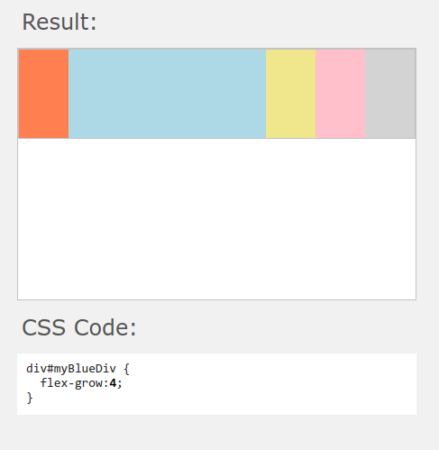

# FlexBox

Esse tipo de elemento serve para deixar os elementos 'flexiveis' o bastante para se adequarem ao tamanho do elemento pai. Na pratica estamos falando de um definir um estilo que se adequa a qualquer tamanho de tela.

## Definir a propriedade

```css
elementoPai{
    display: flex;
}
```

> Ao aplicas `display: flex;` em um elemento que tenha filhos, todos eles vao ter uma mudanca.
> Sendo assim podemos atraves do mesmo aplicar mudancas em todos os seus filhos.

## Flex-direction

Define como os itens flexíveis são colocados no contêiner flexível, definindo o eixo principal e a direção (normal ou invertido).

- `flex-direction: row;`
- `flex-direction: row-reverse;`
- `flex-direction: column;`
- `flex-direction: column-reverse;`


## Flex-wrap

Define se os itens flexíveis são forçados a ficarem na mesma linha ou se podem ser quebradas em varias linhas. Se o argumento for valido, ele define a direção em que as linhas são empilhadas.


- `flex-wrap: nowrap;` -> Os itens flexíveis são agrupados em uma unica linha, o que pode fazer com que o flex container transborde. O cross-start é equivalente ao início ou antes, dependendo do valor da `flex-direction`. **Este é o valor padrão.**
- `flex-wrap: wrap;` -> Os itens flexíveis são quebrados em multiplas linhas. O cross-start é equivalente a iniciar ou antes dependendo do valor do `flex-direction` e cross-end é o oposto do especificado cross-start.
- `flex-wrap: wrap-reverse;` -> Se comporta da mesma maneira que o `wrap` mas a de linha ocorre na direção contrária, ou seja, para a linha acima.


## Flex-flow

A propriedade CSS flex-flow é uma junção das propriedades flex-direction e flex-wrap.
- Syntax
    * `flex-flow: flex-direction flex-wrap;`
```css
/* exemplo */
div {
  display: flex;
  flex-flow: row-reverse wrap;
}
```

## Justify-content

A propriedade `justify-content` alinha os itens do contêiner flexível quando os itens não usam todo o espaço disponível no eixo principal (horizontalmente).

**Syntax**
- `justify-content: flex-start(padrao)|flex-end|center|space-between|space-around|space-evenly;`
    * `flex-start` -> Valor padrão. Os itens são posicionados no início do contêiner.
    * `flex-end` -> Os itens são posicionados no final do contêiner
    * `center` -> Os itens estão posicionados no centro do contêiner
    * `space-between` -> Os itens terão espaço entre eles
    * `space-around` -> Os itens terão espaço antes, entre e depois deles
    * `space-evenly` -> Os itens terão espaço igual ao seu redor


## Align-items

A propriedade `align-items` especifica o alinhamento padrão para itens dentro do contêiner flexível.

**Syntax**

- `align-items: stretch|center|flex-start|flex-end|baseline;`
    * `stretch` -> Padrão. Os itens são esticados para caber no contêiner
    * `center` -> Os itens estão posicionados no centro do contêiner
    * `flex-start` -> Os itens são posicionados no início do contêiner
    * `flex-end` -> Os itens são posicionados no final do contêiner
    * `baseline` -> Os itens são posicionados na linha de base do contêiner
    


## Align-content

A propriedade `align-content` modifica o comportamento da propriedade flex-wrap. É semelhante aos itens de alinhamento, mas em vez de alinhar itens flexíveis, ele alinha linhas flexíveis.

**Syntax**

- `align-content: stretch|center|flex-start|flex-end|space-between|space-around;`
    * `stretch` -> Valor padrão. As linhas se estendem para ocupar o espaço restante	
    * `center` -> As linhas são compactadas em direção ao centro do contêiner flexível	
    * `flex-start` -> As linhas são compactadas no início do contêiner flexível	
    * `flex-end` -> As linhas são embaladas no final do contêiner flexível	
    * `space-between` -> As linhas são distribuídas uniformemente no contêiner flexível	
    * `space-around` -> As linhas são distribuídas uniformemente no contêiner flexível, com espaços de tamanho médio em cada extremidade	
    * `space-evenly` -> As linhas são distribuídas uniformemente no contêiner flexível, com espaço igual ao seu redor


## Flex-shrink

A propriedade `flex-shrink` especifica como o item diminuirá em relação ao restante dos itens flexíveis dentro do mesmo contêiner.

**Syntax**
- `flex-shrink: number;` -> Um número que especifica quanto o item diminuirá em relação ao restante dos itens flexíveis ( O numero e de 0 ate 10, sendo zero nao deixa encolher). O valor padrão é 1


## Flex-grow

A propriedade `flex-grow` especifica quanto o item crescerá em relação ao restante dos itens flexíveis dentro do mesmo contêiner.

**Syntax**
- `flex-grow: number` -> Um número que especifica quanto o item crescerá em relação ao restante dos itens flexíveis ( O numero e de 0 ate 10, sendo zero nao deixa creser). O valor padrão é 0.



## Order

Por padrão, os itens de um Flex Container são exibidos na ordem presente no HTML. Com a propriedade order nós podemos alterar a ordem dos elementos. O valor deve ser um número inteiro, negativo ou positivo

**Syntax**
``` css

order: number;

/* Exemplo */
.container{
   display: flex;
   justify-content: space-evenly;
   align-items: center;  
}
.item.selected{
   order: 1;  
}
```


