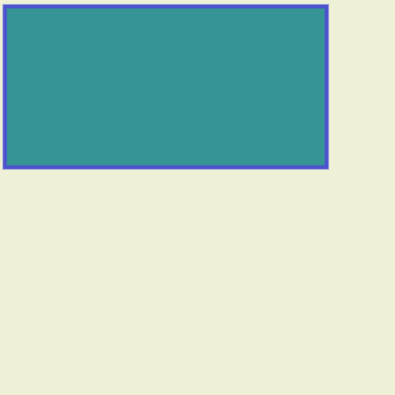
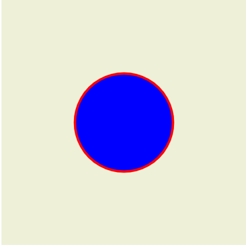

# Javascript Orientado a Objeto

- [Voltar ao arquivo README.md](README.md)
- [Javascript](javascript.md)


Quase todos as propriedades de um objeto que extraem um conteudo do mesmo, pode ser modificado e afetar o conteudo do html onde foi declarado o script.

Para modificarmos apenas precisamos atribuir um valor ao objeto/elemento.

```JS
// Exemplo
document.body.innerHTML = "alteracao"
```
## Objetos

- `window` -> Objeto principal que se refere a janela. Normalmente omitimos ele EX: `window.console.log()` = `console.log()`
- `console.log()` -> Metodo do objeto `window` que utilizamos com frequencia. Ele imprime um conteudo no console do navegador.
- `document` -> Metodo que extrai o documento html em que o script se encontra.
- `documento.body` -> Podemos puxar tags especificas como o `body` nesse caso 


## Alternativas de alteracao de conteudo

- `document.body.innerHTML = conteudo` -> Extrai/Recebe um html e Modificara o conteudo html do objeto respeitando as tags caso seja inseridas.
- `document.body.textContent = conteudo` -> Extrai/Recebe um valor qualquer e Modificara o conteudo da tag do html referente oa objeto.
- `document.body.innerText = conteudo` -> Extrai/Recebe um valor qualquer e Modificara o conteudo que e exibido na pagina/tela.

## Extraindo conteudo

- `document.getElementsByClassName("par")` -> Puxar conteudo de uma tag (ou varias) usando sua class.
- `document.getElementsByTagName("p")` -> Puxar o conteudo pelo nome de uma (ou varias) tag(s).
- `document.getElementsById("id")` -> Puxar o conteudo pelo nome de um `id`.
- `document.querySelector(selectors)` -> Retorna o primeiro elemento dentro do documento (usando ordenação em profundidade, pré-ordenada e transversal dos nós do documento) que corresponde ao grupo especificado de seletores.


OBS: normalmente o resultado dos objetos `document.getElementsBy...` sao arrays (listas) e para extrair o html puro devemos fazer assim:

```JS
document.body.getElementsByTagName("nomeDaTag")[0]; // caso aja mais tag h1 pode verificar o array para ver qua e o que voce quer e indicar o indice.
```
Para realizarmos modificacoes no HTML via CSS3 temos que usar os elementos acima e atribuir a variaveis (e um dos jeitos)

```JS
p = document.getElementsById("id")[0];

```
## Estraindo valores de tags

Para realizarmos isso devemos usar a propriedade `.value` no objeto ou funcao com a tag.
EX:
```JS
let tag = document.getElementById("idDatag");// estou extraindo tag do documento html
console.log(tag.value); // podemos ver que para extrair o valor tive que usar a propriedade `.value`, se for um input sera o 
// valor digitado e se for uma tag com valor determinado sera o valor da tag.
```
> Podemos extrair valores de seletores CSS tambem:
- `document.querySelector(CSS selectors);` -> O método retorna o primeiro elemento que corresponde a um (s) seletor (es) CSS especificado (s) no documento.
- `document.querySelectorAll(CSS selectors)` -> O método retorna todos os elementos no documento que correspondem a um (s) seletor (es) CSS especificado (s), como um objeto estático do NodeList.
- [Ver mais nas anotacoes CSS](/css.md#QuerySelector)
## Modificando conteudo e atributos

A variavel `p` e o HTML extraido no ultimo topico, assim podemos realizar as modificacoes

- `p.className` -> Extrai/Recebe nome da class da tag e possibilita modificacao atribuindo um outro valor.
- `p.style` -> Extrai/Recebe um conteudo html/tag e modifica/extrai o atributo `style`.
- `p.style.backgroundColor` -> Extrai/Recebe um atributo css e modifica/extrai o atributo `backgroudColor`.
OBS: `p.style` tem vario atributos que podemos mudar colocando na variavel `p`, consulte documentacao ou use o intellisense com `ctrl + espaco`
- `p.getAttribute('nomeAtributo')` -> Extrai (apenas) o conteudo do atributo indicado no `valorAtributo`.
- `p.setAttribute('nomeAtributo', 'valorAtributo')` -> Modifica(caso exista)/Cria(caso nao exista) o conteudo do atributo indicado no `valorAtributo`.
obs: Podemos acessar os atributos como objetos EX: `p.src` acessa o atributo `src` e assim vale para qualquer tipo de atributo em HTML
[Mais informacors sobre modificao de atributos](https://www.w3schools.com/jsref/dom_obj_attributes.asp)
- `p.attr.name` -> Retorna o nome de um atributo
EX: 
```JS
var x = document.getElementsByTagName("BUTTON")[0].attributes[0].name;// lembrando que o `.attributes` retorna uma lista, por isso indicar o indice `[0]`
```
- `p.attr.value` -> Define ou retorna o valor do atributo
EX:
```JS
var x = document.getElementsByTagName("BUTTON")[0].attributes[0].value; 

```
## Eventos HTML

- `<tag onclick="codigoJS">` -> atributo que quando ao clicar executa o codigo no valor do atributo.
- `<tagDeEntradaDeTexto oncharge="codigoJS">` -> atributo que quando ao sair do foco executa o `"codigoJS"`.
- `<tagDeEntradaDeTexto oninput="codigoJS">` -> atributo que a cada letra digitada executa o `"codigoJS"`.
- `<tag onload="codigoJS">` -> atributo que executa o `"codigoJS"` apos a pagina HTML carregar.
- `<tag onmouseover="codigoJS">` -> atributo que executa o `"codigoJS"` quando o mouse passa em cima.
- `<tag onmouseout="codigoJS">` -> atributo que executa o `"codigoJS"` quando o mouse passa em cima.
- [Mais eventos](https://www.w3schools.com/jsref/dom_obj_event.asp)

## Editando Eventos direto do javascript

```JS
documentoOuTag = document.getElementById("id");
documentoOuTag.onclick = codigoOuFuncaoJS;// onclick mesma coisa que onclick so que direto no JS
documentoOuTag.addEventListener("EventoHTML", codigoOuFuncaoJS); /* Serve para cria/alterar "EventoHTML" como : 
* "click" = onclick
* "mouseover" = onmouseover
* "mouseout" = onmouseout
*

/* exemplo */

function f1(e){// se essa funcao for declarada no "codigoOuFuncaoJS"/"addEventListener" (sem parenteses), ele passa como parametro "e" o "EventoHTML"
    let teste = e.target;
    console.log(teste)
}

//-------------------

window.onload = FuncaoOuQualquerCoisa // Executa uma funcao ao carregar a pagina
```

## O que e `.target`

Serve para nos referirmos ao elemento que sofreu a ação do objeto.

Ex:

```html

<!DOCTYPE html>
<html>
<body onclick="myFunction(event)">

<p>Click on any elements in this document to find out which element triggered the onclick event.</p>

<h1>This is a heading</h1>

<button>This is a button</button>

<p id="demo"></p>

<script>
function myFunction(event) { 
  var x = event.target;
  document.getElementById("demo").innerHTML = "Triggered by a " + x.tagName + " element";
}
</script>

</body>
</html>

```

saida:


## Acessando tags pais e filhos

OBS: usaremos a variavel `p`

- `p.childrem` -> Extrai a tag filha do elemento HTML
- `p.parentElement` -> Extrai a tag pai do elemento HTML

## Biblioteca Math

- `Math.pi()` -> Exibe o valor de PI
- `Math.sqrt(BaseDaRaiz)` -> Calcula raiz quadrada
- `Math.pow(Base, Expoente)` -> Calculo de potencia
- `Math.random()` -> Gera um numero aleatorio entre 0 e 0.999
- `Math.round(Numero)` -> Arredonda um numero
- `Math.floor(Numero)` -> Arredondamento em piso (arredondar sempre para baixo)
- `Math.ceil(Numero)` -> Arredondar sempre para baixo
[mais](java_math.md)

## JSON - Javascript Object Notation

`JSON` e um representacao de um objeto, nem sempre podemos trabalhar com um objeto 'puro' (principalmente se quisermos mandar para um servidor ou para outra linguagem) entao esse representacao permite que possamos 'converter' o objeto de `string` para um objeto. Eles seriam:

- `JSON.parse(string)` -> converte `string` para `objeto`
- `JSON.stringify(objeto)` -> converte `objeto` para `string`

OBS: padra para string JSON -> `'{"nome":"fabio","idade":26}'` Aspas simples para construcao da string(lado de fora) e aspas duplas para o interior. E todas as palavras inclusive as alfanumericas devem ter aspas duplas e os numeros nao.

## Local Storage - Armazenamento de dados local

- `window.localStorage` -> propriedade padrao, lembrando que o objeto `window` pode ser omitido.
- `localStorage.setItem(StringChave, String)` -> Grava um dado na memoria do navegador 
- `localStorage.getItem(StringChave)` -> Extrai o dado gravado no navegador
- `localStorage.removeItem()` -> Remove o dado gravado no navegador
- `localStorage.clear()` -> Limpa todo(s) o(s) dado(s) gravado(s) no navegador.

## Recarregar pagina

- `location.reload()` -> recarrega pagina.

## Temporizador

- `window.setTimeout(codigoJS, TempoEmMilissegundos)` -> Depois que o tempo no parametro `TempoEmMilissegundos` passar, o parametro `codigoJS` e executado.
- `window.setInterval(codigoJS, TempoEmMilissegundos)` -> Depois que o tempo no parametro `TempoEmMilissegundos` passar, o parametro `codigoJS` e executado e logo depois retornando a contagem (ciclo infinito).
- `window.clearInterval(VariavelArmazenaSetInterval)` -> Essa funcao para o `setInterval` armazenado em uma variavel.
- `window.clearTimeout(VariavelArmazenaSetTimeout)` -> Essa funcao para o `setTimeout` armazenado em uma variavel.

## Alterando atributos HTML com javascript

Esse comando ja foram mostrados antes mas nesse topico iremos mostrar de novo.

- `documentoOuTag.getAttribute('nomeAtributo')` -> Extrai (apenas) o conteudo do atributo indicado no `valorAtributo`.
- `documentoOuTag.setAttribute('nomeAtributo', 'valorAtributo')` -> Modifica(caso exista)/Cria(caso nao exista) o conteudo do atributo indicado no `valorAtributo`.
- `documentoOuTag.addEventListener("nomeAtributo", codigoOuFuncaoJS);` -> Serve para cria/alterar Eventos HTML. [Lista de eventos HTML](https://www.w3schools.com/tags/ref_eventattributes.asp)
OBS: Para referenciarmos um Evento omitirmos o 'on'
    * "click" = onclick
    * "mouseover" = onmouseover
    * "mouseout" = onmouseout

## Alterando atributos usando `dataset`

Uma maneira de alterarmos dados em atribuntos em HTML e utilizando o prefixo `data` nos atributos (criados e nao nativos).

EX:

- `<tag data-numero='numero'>` -> declaramos esses atributos criados com o prefixo `data-` e depois o nome do atributo, ficando `data-algumacoisa`.

Declarando os atributos HTML desta maneira, podemos extrair seus valores no `javascript` utilizando a propriedade `.dataset.atributo`.

- `p.dataset.numero` -> O objeto `p` e a tag que HTML que extraimos, sendo o `dataset` a propriedade para extracao dos atributos `data-####`, seguido do nome do atributo sem o `data-`. Assim extraimos o valor. 

## Alterando `<video>` no javascript

OBS: `video` e igual a `document.getElementsById("id")` sendo o `id` o nome da tag de video

- `video.play()` -> Executar o video
- `video.pause()` -> Para o video
- `video.currentTime()` -> Exibe o Tempo do video
- `video.currentTime = tempo` -> Altera o tempo do video.
- `video.playbackRate = tempo` -> Manipula a velocidade do video

## Alterando `<audio>` no javascript

Exemplo do uso da tag `<audio>`
```html
<!-- Reprodução multi-audios em caso de incompatibilidade -->
<audio controls>
    <source src="horse.ogg" type="audio/ogg">
    <source src="horse.mp3" type="audio/mpeg">
</audio>
<!-- Reprodução simples de áudio -->
<audio src="https://developer.mozilla.org/@api/deki/files/2926/=AudioTest_(1).ogg" autoplay>
    O seu navegador não suporta o elemento <code>audio</code>.
</audio>

<!-- Reprodução de áudio com legendas -->
<audio src="foo.ogg">
    <track kind="captions" src="foo.en.vtt" srclang="en" label="English">
    <track kind="captions" src="foo.sv.vtt" srclang="sv" label="Svenska">
</audio>
```
- Atributos HTML
    * `autoplay` -> Especifica que o áudio começará a ser reproduzido assim que estiver pronto
    * `controls` -> Especifica que os controles de áudio devem ser exibidos (como um botão play / pause etc)
    * `loop` -> Especifica que o áudio começará novamente, toda vez que terminar
    * `muted` -> Especifica que a saída de áudio deve ser silenciada
    * `preload` -> Especifica se e como o autor acha que o áudio deve ser carregado quando a página é carregada
    * `src` -> Especifica o URL do arquivo de áudio

- Atributos JS
    * `audio.play()` -> Executar o video
    * `audio.pause()` -> Para o video
    * `audio.currentTime()` -> Exibe o Tempo do video
    * `audio.currentTime = tempo` -> Altera o tempo do video.
    * `audio.playbackRate = tempo` -> Manipula a velocidade do video


## Canvas

Canvas e uma **API** que serve para realizarmos desenhos e animacoes graficas via `javascript` e via `HTML`. Com ela podemos criar tambem Jogos, visualizacao de dados, manipulacao de fotos e processamento de video em tempo real.

Canvas foca amplamente em **2D** podendo usar **3D** atraves do **WebGl** que tambem trabalha tanto com **3D/2D**.

### Como canvas funciona?

primeiro nos declaramos uma tag `<canvas>` no HTML

```html
<canvas id="canvas" width='500' height='500'></canvas>
<!-- e recomentado atribuir um id como feito acima e definir largura e altura com propriedade weidth e height-->
```

O codigo acima apenas cria uma espaco em branco invisivel, podemos definir um estilo atraves do **CSS** para definir um tamanho e ate uma cor.


```html

<style>
.canvas{
    /* definindo cor */
    background-color: green;
    /* definindo largura e altura */
    width: 500px;
    height: 500px; /* Sendo que definir tamanho em css e diferente que definir usando as propriedades da tag <canvas> */
}
</style>

<canvas id="canvas" width='500' height='500'></canvas>

```

> **OBS:** Lembrando que podemos alterar o estilo pelo `javascript`.

Agora entraremos na parte do `javascript` comecando extraindo a tag **HTML** e atribuindo a uma variavel.

```javascript

let variavelCanvas = document.getElementById("canvas");

```

depois iremos extrair o "contexto" do elemento **canvas** atribuido na variavel `variavelCanvas` que foi declarada e extraida no **HTML** para podermos efetuar manipulacao.

```javascript
let ctx = tela.getContext("2d");
// O contexto foi colocado na variavel 'ctx'
```
 Como pode ver utilizamos o metodo `getContext` para realizarmos a extracao e tambem atribuimos string `"2d"` como propriedade, isso diz apenas que iremos realizar manipulacao graficas em **2D**, caso quisemos fazer mapulacaes em **3D** e so passar o memo como `"3d"`.

### Metodos para desenhar linhas

 Agora iremos apresentar alguns metodos para desenhar linhas.

- `ctx.moveTo(x, y);` -> Move o ponto inicial da manipulacao para a coordenados dos parametros **x** e **y**
- `ctx.lineTo(x, y);` -> Conecta o ultimo ponto declarado ate a coordenada declaradas nos parametro **x** e **y** criando uma linha.
- `ctx.lineWidth = valor;` -> Define a tamanho do contorno que sera criado 
- `ctx.fillStyle = 'green';` -> Define preencimento do desenho.
- `ctx.strokeStyle = "black"` -> Define a cor do contorno.
> OBS: Os metodos acima deve-se ser declarado antes do metodo `stroke`, caso contrario nao surtira efeito.
- `ctx.stroke();` -> Contorna nos conjuntos de linhas criados.

### Exemplo - Desenhando linhas

 ```javascript
let tela = document.getElementById("tela");

let ctx = tela.getContext("2d");
ctx.moveTo(0, 0);
ctx.lineTo(250, 250);
ctx.lineTo(500, 0);
ctx.lineTo(0, 0);
ctx.lineTo(0, 500);
ctx.lineTo(500, 500);
ctx.lineTo(500, 0);
ctx.lineWidth = 5;
ctx.stroke();
 ```
 ### Resultado


### Desenhando retangulo

Os proximos metodos que iremos utilizar servem para criarmos um retangulo com preenchimento.

Sendo esse metodos:

- `ctx.fillStyle = 'blue' ` -> Metodo para escolher a cor do preenchimento 
- `ctx.fillRect(x, y, width, height)` -> Metodo para definir o tamanho do preenchimento, sendo o `x` e `y` a margem desse preenchimento e `width` e `height` a largura e altura.
- `ctx.strokeStyle = 'red' ` -> Metodo para escolher a cor do contorno
- `ctx.strokeRect(x, y, width, height)` -> Metodo para definir as  do contorno, sendo o `x` e `y` a margem desse contorno e `width` e `height` a largura e altura
- `ctx.rect(x, y, width, height)` -> Definir as coordenadas apenas sendo o `x` e `y` a margem desse contorno e `width` e `height` a largura e altura.
- `ctx.clearRect(x, y, width, height)` -> Definir as coordenadas para limpeza apenas sendo o `x` e `y` a margem desse contorno e `width` e `height` a largura e altura.

### Exemplo 1 - Desenhando retangulo preenchido

```javascript
let tela = document.getElementById("tela");

let ctx = tela.getContext("2d");
ctx.fillStyle = '#4d52ce';
ctx.fillRect(20,20,400,400);
```
### Resultado - Exemplo 1


### Exemplo 2 - Desenhando retangulo somente com contorno

```javascript
let tela = document.getElementById("tela");

let ctx = tela.getContext("2d");
ctx.strokeStyle = '#4d52ce';
ctx.strokeRect(20,20,400,200);
```

### Resultado - Exemplo 2


### Exemplo 3 - Desenhando contorno com preenchimento

```javascript
let tela = document.getElementById("tela");

let ctx = tela.getContext("2d");
// definindo coordenadas
ctx.rect(10,10,400,200);
// definindo cores do contorno e preenchimento
ctx.strokeStyle = '#4d52ce';
ctx.fillStyle = '#379494';
// ativando contorno e preenchimento
ctx.fill();
ctx.stroke();
```
### Resultado - Exemplo 3


> **OBS: Caso queira aumentar o tamanho das linhas voce pode usar o metodo `ctx.lineWidth = 5;` antes do `ctx.fill();` e `ctx.stroke();`.**
> **Deixando o codigo assim;**

```javascript
let tela = document.getElementById("tela");

let ctx = tela.getContext("2d");
ctx.rect(10,10,400,200);
ctx.strokeStyle = '#4d52ce';
ctx.fillStyle = '#379494';
ctx.lineWidth = 5; // <- Aqui esta o metodo para aumentar o tamanho do contorno
ctx.fill();
ctx.stroke();
```
 > **Resultando em...**



### Exemplo 4 - Limpando desenho

```javascript
let tela = document.getElementById("tela");

let ctx = tela.getContext("2d");
ctx.rect(10,10,400,200);
ctx.strokeStyle = '#4d52ce';
ctx.fillStyle = '#379494';
ctx.lineWidth = 5;
ctx.fill();
ctx.stroke();

ctx.clearRect(20,20,40,20);
```

### Resultado - Exemplo 4


## Criando novos caminhos ou formas no Canvas

Para iniciarmos uma nova linha/caminho ou adicionar formas, utilizarmos o metodo `ctx.beginPath`.

### Exemplo 1 - Criando novas linhas/caminhos ou formas
```javascript
let tela = document.getElementById("tela");

let ctx = tela.getContext("2d");
ctx.lineWidth = 5;
ctx.moveTo(10,10);
ctx.strokeStyle = 'blue';
ctx.lineTo(200,400);
ctx.lineTo(200,200);
ctx.stroke();

ctx.beginPath(); // Criando nova linha

ctx.lineWidth = 5;
ctx.moveTo(10,10);
ctx.strokeStyle = 'red';
ctx.lineTo(100,400);
ctx.lineTo(100,200);
ctx.stroke();
```

### Resultado - Exemplo 1


Podemos tambem fechar automaticamente um conjunto de linhas que nao fecham um ciclo com o metodo `ctx.closePath();`
### Exemplo 2

```javascript
let tela = document.getElementById("tela");

let ctx = tela.getContext("2d");
ctx.lineWidth = 5;
ctx.moveTo(10,10);
ctx.strokeStyle = 'blue';
ctx.lineTo(200,400);
ctx.lineTo(200,200);
ctx.closePath(); // Fecha elemento
ctx.stroke();

ctx.beginPath();

ctx.lineWidth = 5;
ctx.moveTo(10,10);
ctx.strokeStyle = 'red';
ctx.lineTo(100,400);
ctx.lineTo(100,200);
ctx.closePath(); // Fecha elemento
ctx.stroke();
```

### Resultado - Exemplo 2


## Desenhando um circulo

Para desenhar um circulo usamos o metodo `ctx.arc()` sendo seus parametros:
- `ctx.arc(x, y, raio, anguloInicial, anguloFinal [, antiHorario])`
    * **x** -> A coordenada horizontal do centro do arco.
    * **y** -> A coordenada vertical do centro do arco.
    * **raio** -> O raio do arco. Deve ser um valor positivo.
    * **anguloInicial** -> O ângulo em radianos em que o arco começa medido a partir do eixo x positivo.
    * **anguloFinal** -> O ângulo em que o arco finaliza medido a partir do eixo x positivo.
    > OBS: O angulo e definito em PiRadiano (unidade de medida de angulo) e para converter um numero nessa medida usamos a formula `X * Pi`. Um circulo mede 2 PiRadianos. Usando a formula seria `2 * 3.14(Pi)`.
    * **antiHorario** Optional -> Um Boolean opcional. Se verdadeiro, desenha o arco no sentido anti-horário entre os ângulos inicial e final. O padrão é falso (sentido horário).

> OBS: **Sim, todos os circulos no funco sao arcos.

### Exemplo 1 - Desenhando circulo
```javascript
let tela = document.getElementById("tela");

// Essa parte definimos os dados do parametros do metodo arc.
let x = 250;
let y = 250;
let raio = 100;
let inicio = 0;
let fim = 2 * Math.PI; // Utilizando Piradianos para podermos utilizar a medida
// um circulo tem 2 PiRadianos

let ctx = tela.getContext("2d");
ctx.beginPath();
ctx.lineWidth = 5;
ctx.strokeStyle = 'red';
ctx.fillStyle = 'blue';

// Metodo para criar o circula
ctx.arc(x,y,raio,inicio,fim);

ctx.fill();
ctx.stroke();
```

### Resultado - Exemplo 1



## Animacao com canvas

Animacao nao ha uma regra, mas o objetivo e o mesmo que seria que encontrar uma maneira de representar imagens em seguencia que dao a sensacao de animacao. As formar para chegar ao nosso objetivo podem ser lacos de repeticao, objetos ou metodos que possibilitem esse processo. No caso irei mostrar utilizando o metodo `setInterval` para representar exatamente o que estou falando.

### Exemplo - Animacao Basica
```javascript
let tela = document.getElementById("tela");
let ctx = tela.getContext("2d");

// Criando um objeto para facilitar a utilizacao e manipulacao
let circle = {
    x: 250,
    y: 250,
    raio: 100,
    inicio: 0,
    fim: 0,
};

// Funcao responsavel para desenhar o circula
function drawCircle(c) {
    // Tudo nesse metodo esta nos topicos anteriores
    // Esse bloclo de codigo serve para quando comecar um desenho, ele apaga o anterior. Isso ajuda pois na animacao sem isso ela fica com rastro.
    ctx.beginPath();
    ctx.rect(0,0,500,500);
    ctx.fillStyle = "rgb(238, 240, 216)"
    ctx.fill();

    // Como podemos ver, mais uma linha criada no canvas.
    // Desenhando circulo
    ctx.beginPath();
    ctx.lineWidth = 5;
    ctx.strokeStyle = "red";
    ctx.fillStyle = "blue";

    ctx.arc(c.x, c.y, c.raio, c.inicio, c.fim); // Utilizando o objeto `circle` para ter acesso as propriedades no mesmo e criar o circulo com o metodo `arc`

    ctx.fill();
    ctx.stroke();
}

// Ao inves de utilizar um laco de repeticao, preferi usar o metodo `setInterval` pois ela permite controlar o tempo dessa animacao
setInterval(function () {
    if (circle.fim < 2 * Math.PI) {
        circle.fim += 0.3;
        circle.x += 4;
    }

    drawCircle(circle);
}, 40);
```

### Resultado - Exercicio 1


## Colocando imagens no Canvas

Para que possamos fazer esse feito (uma das formas e nao a unica) e preciso que a imagem esteja no documento **HTML** a puxemos no **Javascript**, assim podendo manusear essa imagem no **Canvas**. Para 'desenhar' a imagem utilizaremos o metodo abaixo:

- `ctx.drawImage(image, sx, sy, sWidth, sHeight, dx, dy, dWidth, dHeight);` -> O método referido da API Canvas 2D fornece diferentes maneiras de desenhar uma imagem na tela.
    * Parametros
        1. `image` -> An element to draw into the context. The specification permits any canvas image source (CanvasImageSource), specifically, a CSSImageValue, an HTMLImageElement, an SVGImageElement, an HTMLVideoElement, an HTMLCanvasElement, an ImageBitmap, or an OffscreenCanvas.

        2. `sx` **Optional** -> A coordenada do eixo x do canto superior esquerdo do sub-retângulo da imagem de origem para desenhar no contexto de destino. Use a sintaxe de 3 ou 5 argumentos para omitir esse argumento.

        3. `sy` **Optional** -> A coordenada do eixo y do canto superior esquerdo do sub-retângulo da imagem de origem para desenhar no contexto de destino. Use a sintaxe de 3 ou 5 argumentos para omitir esse argumento.

        4. `sWidth` **Optional** -> A largura do sub-retângulo da imagem de origem para desenhar no contexto de destino. Se não especificado, é usado o retângulo inteiro das coordenadas especificadas por sx e sy até o canto inferior direito da imagem. Use a sintaxe de 3 ou 5 argumentos para omitir esse argumento.

        6. `sHeight` **Optional** -> A altura do sub-retângulo da imagem de origem para desenhar no contexto de destino. Use a sintaxe de 3 ou 5 argumentos para omitir esse argumento.

        7. `dx` -> O eixo x coordena na tela de destino na qual colocar o canto superior esquerdo da imagem de origem.

        8. `dy` -> O eixo y coordena na tela de destino na qual colocar o canto superior esquerdo da imagem de origem.

        9. `dWidth` -> A largura para desenhar a imagem na tela de destino. Isso permite a escala da imagem desenhada. Se não especificado, a imagem não é dimensionada em largura quando desenhada. Observe que esse argumento não está incluído na sintaxe de 3 argumentos.

        10. `dHeight` -> A altura para desenhar a imagem na tela de destino. Isso permite a escala da imagem desenhada. Se não especificado, a imagem não é dimensionada em altura quando desenhada. Observe que esse argumento não está incluído na sintaxe de 3 argumentos.    

### Exemplo - Usando uma imagem no canvas

Primeiro colocar a imagem no documento **HTML**

```HTML

<!-- Veja que apesar de declara ele e omitido com a propriedade 'display: none;' -->
```

Agora vamos para o **Javascript**

```javascript
let tela = document.getElementById("tela");
let ctx = tela.getContext("2d");
// puxemos a imagem no documento HTML pelo 'id' atribuido
let imgcanvas = document.getElementById("imagem");
// Metodo para aparecer a imagem no canvas
ctx.drawImage(imgcanvas, 5, 5);
```

### Exemplo 2 - Usando uma imagem no canvas direto no javascript

```javascript
let tela = document.getElementById("tela");
let ctx = tela.getContext("2d");

let imgcanvas = new Image(); // Criando um objeto para receber imagem
imgcanvas.src = "./img/1001tracklists.svg"; // Atribuindo o caminho da imagem

imgcanvas.onload = desenhandoImagem(); // Metodo onload usado e para sabermos quando a imagem parou de carregar, no caso e quando a funcao `desenhandoImagem()` for executada

function desenhandoImagem(){ // Criando o metodo que ira desenhar a imagem
    ctx.drawImage(this/* O metodo 'this' esta se referindo a variavel 'imgcanvas'*/, 5, 5);
}
```

### Extra - utilizando objeto `Image()` no JS

- `let img = new Image();` -> Criando um objeto para receber imagem
- `img.src = 'picture.jpg';` -> Atribuindo o caminho da imagem
- `img.naturalWidth` -> Retornar a largura original/natural da imagem
- `img.naturalHegth` -> Retornar a altura original/natural da imagem


