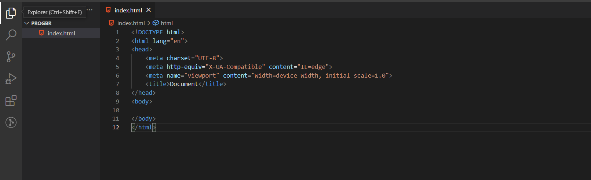

## [Voltar ao arquivo README.md](../README.md)

# Tutorial ProgramadorBR

[Link Original](https://firebase.google.com)

# Como importar o Firebase?

---

Depois da atualização para versão 9, o firebase acabou adicionando uma nova maneira de utilização com as importações modulares que não entraremos em detalhes aqui nesse artigo.

Abaixo estarei colocando o procedimento até a importação e utilização do firebase para você poder prosseguir com o módulo.

### 1° Passo - Criação do projeto:



Perceba que temos um esqueleto comum do html.

### 2° Passo - Fazendo login e criando projeto no firebase:

Aqui nos temos que entrar no site do firebase: [https://firebase.google.com/](https://firebase.google.com/)

Começamos pela seguinte tela:

.png)

---

Apertaremos em **Começar**, em seguida entraremos na seguinte tela:

.png)

---

Realizaremos nosso cadastro ou login na sua conta Google.

Apos isso estaremos na seguinte tela:

.png)

---

Em seguida apertaremos em **Adicionar Projeto:**

.png)

---

Colocaremos um nome do projeto:

.png)

---

Apertaremos em continuar:

.png)

---

Rolaremos a página um pouco mais para baixo:

.png)

---

Podemos adicionar apertar em continuar caso queira adicionar o Google Analytics no seu projeto, nesse exemplo eu desmarcarei:

.png)

---

Apertarei em **Criar projeto**:

.png)

---

Após apertar em **continuar**, nos entraríamos na seguinte página:

.png)

Perceba que no centro da página existem alguns ícones para adicionar seu projeto, nos apertaremos nesse terceiro:

.png)

---

Aqui nos registraremos nosso app:

.png)

Colocaremos o nome e depois apertaremos em **Registrar app**.

Depois do seu app adicionado entramos na seguinte no próximo passo.

---

### 3° Passo - Pegando firebaseConfig para integração no seu projeto:

 

Apos ter registrado o app, estaremos no ponto mais importante:

.png)

---

Perceba que temos muitas informações abaixo que podem confundir no momento do curso.

Você entenderá melhor o lance do npm nos módulos de node. 

O ponto principal aqui é o firebaseConfig, nós desceremos um pouco a página e copiar apenas ele:

.png)

Copiaremos apenas esse trecho, voltaremos para nosso projeto e adicionaremos uma tag script com essa constante nele dentro dele:

.png)

---

Após ter o firebaseConfig nos precisamos das importações do firebase para que nosso projeto funcione.

Entraremos nesse site aqui:

[https://firebase.google.com/docs/firestore/quickstart?authuser=0#web-v8](https://firebase.google.com/docs/firestore/quickstart?authuser=0#web-v8)

Após entra nesse site nos devemos descer até a seguinte parte:

.png)

---

Perceba que nesse caso está marcado na versão 9 ali em cima, você precisa colocar na versão 8 para web (namespaced):

.png)

---

**OBS:** Perceba que no site ele não coloca a versão 8, na verdade ele coloca para importação da versão 9, provavelmente algum bug no site deles que passou despercebido. ☹️

Precisamos que seja uma versão qualquer abaixo da 9, pois se você importar a versão 9 pode dar algum erro. :(

Alteraremos a parte que está 9.0.1 para 8.10.0, está assim:

```jsx
<script src="https://www.gstatic.com/firebasejs/9.0.1/firebase-app.js"></script>
<script src="https://www.gstatic.com/firebasejs/9.0.1/firebase-firestore.js"></script>
```

Alteraremos para isso na hora de colocar no projeto:

```jsx
<script src="https://www.gstatic.com/firebasejs/8.10.0/firebase-app.js"></script>
<script src="https://www.gstatic.com/firebasejs/8.10.0/firebase-firestore.js"></script>
```

## OBS:

Para utilizar as demais funcionalidades como o storage ou o auth, a ideia seria basicamente a mesma.

você adicionaria no seu projeto o mesmo script com o final alterado:

.png)

o mesmo vale para o storage:

.png)

Igor fala a respeito disso em alguma das aulas de firebase. :)

---

Com eles, adicionaremos lá no nosso projeto, acima do script que já tínhamos importado:

.png)

### 4° Passo - Inicializando as configurações para execução no curso:

Abaixo do firebaseConfig dentro daquele script nos adicionaremos algumas coisas:

```jsx
firebase.initializeApp(firebaseConfig)
const db = firebase.firestore()
```

Ficaria assim:

.png)

OBS: Aqui depois da linha de inicialização você precisará adicionar uma nova linha de código para evitar alguns erros:

.png)

Deixarei o trecho de código abaixo caso queira copiar e colar:

```jsx
firebase.firestore().settings({
        experimentalForceLongPolling: true,
        merge: true,
      });
```

> Lembre-se também de alterar as permissões do firestore quando for utilizar.
> 

---

A partir desse ponto conseguiremos acompanhar o módulo de firebase tranquilamente. 🙂😎